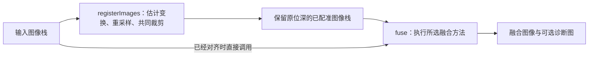

# 配准与多聚焦融合原理

本项目把配准和融合分成两个独立阶段：配准让同一结构落在相同坐标，融合从不同焦点的图像中组合清晰信息。当前提供 ECC、SIFT 两种配准方法，以及 GFF、拉普拉斯金字塔、DCT 块方差、DTCWT、GFG-FGF 五种融合方法，均由 C++ 和 OpenCV 执行，不加载 AI 模型。

本文以当前代码为准，说明计算流程、公式、参数和限制。调用示例见 [SDK 使用](sdk.md)，源码目录见 [算法模块导航](../algorithms/README.md)。

- [输入、输出与整体流程](#1-输入输出与整体流程)
- [配准原理](#2-配准原理)
- [融合前的基础知识](#3-融合前的基础知识)
- [五种融合方法](#4-五种融合方法)
- [诊断图与方法比较](#5-诊断图与方法比较)
- [源码与扩展入口](#6-源码与扩展入口)
- [参考来源与实现关系](#7-参考来源与实现关系)

## 1. 输入、输出与整体流程

### 1.1 三个公开入口



`registerAndFuse()` 顺序调用 `registerImages()` 和 `fuse()`，与显式两步调用使用相同的中间像素。

| 入口 | 输入要求与处理 | 返回内容 |
|---|---|---|
| `registerImages` | 同一批次、同尺寸图像；第一张作为参考 | `RegistrationResult.images`、`crop`、`transforms` |
| `fuse` | 调用者提供已经对齐的图像；仅执行融合 | `FusionResult.image`、`focus_indices`、`weights` |
| `registerAndFuse` | 先按配准设置处理，再按融合设置处理 | `PipelineResult.fusion`，以及 `crop`、`transforms` |

`fuse()` 不检查图像是否在几何上对齐，也不读取配准参数。组合调用默认 `RegistrationMethod::None`，因此需要显式开启配准。C++ 组合结果中的融合字段放在 `result.fusion`；Python 的组合结果是包含这些字段的平面字典。

### 1.2 类型、数值范围与所有权

所有入口要求：

- 至少两张二维图像，数量能用 `int32` 表示；宽、高均至少为 2。
- 所有图像的尺寸、深度、通道数相同，支持灰度和 BGR 三通道。
- 深度为 `CV_8U`、`CV_16U` 或 `CV_32F`；浮点值必须有限且位于 `[0, 1]`。
- 允许非连续 ROI；算法不修改输入。调用期间，调用者须保持输入有效，且不从其他线程修改它。

记原图为 $`X_i`$，归一化工作图为 $`I_i`$：

```math
I_i =
\begin{cases}
X_i/255, & \text{uint8} \\
X_i/65535, & \text{uint16} \\
X_i, & \text{float32}
\end{cases}
```

工作图分配为独立的 `CV_32F` 缓冲区。DTCWT 变换内部另用双精度，方法出口回到 `CV_32F`。融合完成后把像素裁到 `[0, 1]`，再恢复输入的深度和通道数；保持位深不等于保留输入像素值，重采样、加权和整数舍入都会改变数值。

独立配准同样恢复输入位深。因此整数图像在“配准 → 融合”之间经过一次量化；相较早期隐藏的全浮点贯通流程，结果可能有少量像素差异。当前组合入口与显式两步调用严格遵循同一约定。

## 2. 配准原理

配准对每张源图独立求解到第一张参考图的几何关系，不逐张串联变换。两种求解器共用灰度转换、工作分辨率、几何检查、重采样和裁剪流程。

### 2.1 方法与运动模型

`RegistrationMethod` 决定“怎样估计变换”，`MotionModel` 决定 ECC“允许怎样运动”。

| `method` | `motion_model` | 自由度与含义 | 返回矩阵 |
|---|---|---|---|
| `None` | 不使用 | 不估计、不重采样，返回独立副本 | 2×3 单位矩阵 |
| `Ecc` | `Translation` | 2：水平、垂直位移 | 2×3 |
| `Ecc` | `Affine` | 6：平移、旋转、缩放、剪切 | 2×3 |
| `Ecc` | `Homography` | 8：单应性，包含平面透视变化 | 3×3 |
| `Sift` | 不使用 | SIFT 匹配和 RANSAC，固定估计单应性 | 3×3 |

默认方法为 `None`，默认 ECC 模型为 `Translation`。SIFT 忽略 `motion_model` 的合法取值，但所有方法都会拒绝非法枚举。

用参考坐标 $`(x,y)`$ 表示源图采样位置 $`(x',y')`$，三个 ECC 模型分别为：

**平移模型：**

```math
\begin{aligned}
x' &= x+t_x \\
y' &= y+t_y
\end{aligned}
```

**仿射模型：**

```math
\begin{bmatrix}
x' \\
y'
\end{bmatrix}
= \begin{bmatrix}
a_{11} & a_{12} & t_x \\
a_{21} & a_{22} & t_y
\end{bmatrix}
\begin{bmatrix}
x \\
y \\
1
\end{bmatrix}
```

**单应性模型：**

```math
\begin{aligned}
x' &= \frac{h_{11}x+h_{12}y+h_{13}}{h_{31}x+h_{32}y+1} \\
y' &= \frac{h_{21}x+h_{22}y+h_{23}}{h_{31}x+h_{32}y+1}
\end{aligned}
```

允许更多自由度能描述更复杂的全局变化，也需要图像内容提供足够约束。单应性仍是一张全局变换，不能表达不同物体各自移动或明显的深度视差。

### 2.2 ECC：最大化图像相关性

ECC 直接比较参考图 $`T`$ 与变换后的源图 $`S(W_\theta(x))`$，调整运动参数 $`\theta`$ 提高相关性。把参与比较的像素减去各自均值，记为 $`\tilde{T}`$、$`\tilde{S}_\theta`$，其目标可写为：

```math
\begin{aligned}
\theta^* &= \arg\max_{\theta}\;\rho(\theta) \\
\rho(\theta) &=
\frac{\sum_{x\in\Omega_\theta}\tilde{T}(x)\tilde{S}_\theta(x)}
{\sqrt{\sum_{x\in\Omega_\theta}\tilde{T}(x)^2}
 \sqrt{\sum_{x\in\Omega_\theta}\tilde{S}_\theta(x)^2}}
\end{aligned}
```

$`\Omega_\theta`$ 表示当前变换下用于比较的有效位置。中心化与归一化降低了整体亮度偏移和增益变化的影响，但局部反光、失焦差异、饱和像素仍会改变匹配依据。迭代由 OpenCV `findTransformECC` 完成。[ECC 论文][ecc-paper]、[OpenCV 接口约定][opencv-ecc]。

本项目的执行步骤：

1. 转为归一化灰度图，并缩小到工作分辨率。
2. 参考图和源图各做一次 5×5、`sigma=1.2` 高斯平滑，使估计更多依赖共有结构。
3. 检查平滑后的标准差；小于 `1e-6` 或非有限时，按无纹理图像报错。
4. 每张源图从单位矩阵开始，在一个工作分辨率上优化。ECC 内部高斯窗口设为 1，避免重复平滑。
5. 拒绝 OpenCV 求解异常，以及非有限或不大于零的相关分数；通过后进入共用几何检查。

`iterations` 是迭代次数上限，`epsilon` 是相邻迭代相关系数变化的阈值，不是像素对齐误差。达到迭代上限、得到正相关分数或通过几何检查，都不能单独证明已经准确对齐。

当前实现适合初始位置已经接近、存在共同结构的图像。没有配准金字塔、外部初始矩阵，也没有“先 SIFT、再 ECC”的组合求解；大位移、严重失焦差异或错误局部极值仍可能导致失败或错误对齐。

### 2.3 SIFT 与 RANSAC：从对应点估计单应性

SIFT 在不同高斯平滑尺度下构建尺度空间，通过高斯差分（DoG）在空间和尺度上的局部极值寻找关键点，并剔除低对比度或沿边缘不稳定的候选点。随后根据邻域梯度确定主方向，在对应尺度和方向下统计 4×4 个子区域、每区 8 个方向的梯度直方图，形成 128 维描述子。尺度选择与方向归一化使同一局部结构在缩放、旋转后仍能产生相近的描述，从而更容易找到对应点。[OpenCV SIFT 原理](https://docs.opencv.org/4.12.0/da/df5/tutorial_py_sift_intro.html)、[Lowe 原论文](https://www.cs.ubc.ca/~lowe/papers/ijcv04.pdf)。

本项目通过这些关键点的对应关系求解单应性，使用 OpenCV 实现以下流程。[OpenCV 特征匹配与单应性示例][opencv-sift]。

1. 把工作灰度图临时转换为 8 位用于 SIFT；参考特征只提取一次。高位深原图仍保留给最终重采样。
2. 对每个参考描述子，在源图中寻找 L2 距离最近的两个描述子。
3. 只保留满足 $`d_1 < r\,d_2`$ 的匹配，其中 $`r`$ 对应参数 `match_ratio`。次近邻距离为零或距离非有限时丢弃。
4. 按描述子距离排序，去掉重复源特征及双方重复坐标，至少保留 6 个位置不重复的对应点。
5. RANSAC 从候选对应点中估计单应性，按工作图像上的重投影误差筛内点，再由 OpenCV 优化模型。
6. 至少需要 6 个内点，内点比例达到 `min_inlier_ratio`，并检查双方内点的空间分布。

对参考点 $`p_j`$ 和源图点 $`q_j`$，RANSAC 使用的误差是：

```math
e_j=\left\|\pi(Hp_j)-q_j\right\|_2
```

其中 $`\pi`$ 表示除以齐次坐标第三项。`ransac_threshold` 的单位是**工作分辨率像素**。RANSAC 使用 OpenCV 默认的 2000 次迭代上限和 0.995 置信度，不使用 ECC 的 `iterations`。

空间分布检查要求：内点坐标协方差的较小特征值至少为 $`1`$，且不小于较大特征值的 $`10^{-3}`$；凸包面积至少为 $`\max(16,10^{-4}WH)`$。这些条件用于拒绝集中在一点、很小区域或近似一条直线上的匹配。

有足够共同特征时，SIFT 可以估计比单位矩阵初始化的 ECC 更大范围的几何变化。严重失焦会减少共同特征，重复纹理可能产生一致但错误的匹配；内点比例高也不保证整幅图像都能由同一单应性准确描述。当前匹配采用单向两近邻筛选，没有额外的双向交叉匹配检查。

### 2.4 工作分辨率、矩阵方向与共同裁剪

**估计分辨率。** 令缩放比例为 $`\min(1,L_{\max}/\max(W,H))`$，其中 $`L_{\max}`$ 对应参数 `max_size`；横纵尺寸分别取整。不会放大小图；开启配准后，工作图的两边均须至少为 16，否则报错。

**坐标换算。** 内部求解器统一返回“参考工作坐标 → 源图工作坐标”的双精度 3×3 矩阵 $`H_{\mathrm{work}}`$。按 OpenCV resize 的像素中心约定，原图到工作图的映射为：

```math
\begin{aligned}
R &=
\begin{bmatrix}
s_x & 0 & (s_x-1)/2 \\
0 & s_y & (s_y-1)/2 \\
0 & 0 & 1
\end{bmatrix} \\
H &= R^{-1}H_{\mathrm{work}}R
\end{aligned}
```

这里 $`s_x=W_w/W`$、$`s_y=H_w/H`$ 使用取整后的真实比例，因此兼容奇数尺寸。几何检查会拒绝非有限、不可逆、方向翻转或投影分母在图像内接近零的矩阵。

**重采样。** 每张非参考图只在原始分辨率上执行一次双线性重采样，调用 `warpAffine` 或 `warpPerspective`，并设置 `WARP_INVERSE_MAP`。输出坐标沿 $`H`$ 查找源图位置：

```math
J_i(x,y)=I_i\!\left(\pi(H_i[x,y,1]^T)\right)
```

**去掉无效边缘。** 对全 1 浮点掩码执行相同的变换和插值；覆盖值至少为 `0.9999` 才视为有效。取所有输入有效掩码的交集，在其中寻找面积最大的轴对齐内接矩形。它不会包含插值混入边界补零的角落；矩形短边小于 8 时明确失败。

返回值的坐标约定：

- `crop` 位于**第一张原图**的坐标系中。
- `transforms[i]` 为 `CV_32F`，映射**参考原图坐标 → 第 i 张原图坐标**；第一张是单位变换。
- 配准输出图的像素 $`(u,v)`$ 对应参考原图 $`(u+c_x,v+c_y)`$，其中 $`c_x`$、$`c_y`$ 分别对应 `crop.x`、`crop.y`。先加裁剪偏移，再应用 `transforms[i]`；3×3 变换还需做齐次除法。
- `None` 返回整图 `crop` 和 2×3 单位矩阵，即使 `motion_model` 设为合法的 `Homography` 也一样。

矩阵没有隐含裁剪偏移，不能直接把裁剪后坐标代进去。求解失败会附带从 1 开始的图片序号，不会静默改用单位矩阵或其他方法。

### 2.5 配准参数

以下是 C++ `RegistrationOptions` 字段；所有字段均会校验，包括当前方法没有使用的字段。

| 字段 | 默认值 | 范围与作用 |
|---|---|---|
| `method` | `None` | `None`、`Ecc`、`Sift` |
| `motion_model` | `Translation` | `Translation`、`Affine`、`Homography`；仅 ECC 使用 |
| `iterations` | 150 | `[1, 10000]`；ECC 每张图的迭代上限 |
| `epsilon` | `1e-5` | 有限正数；ECC 相关系数变化阈值 |
| `max_size` | 1200 | `[16, 8192]`；两种方法共用的工作图最长边上限 |
| `max_features` | 4000 | `[64, 100000]`；SIFT 特征数上限 |
| `match_ratio` | 0.75 | 有限且在 `(0, 1)`；越小，最近邻筛选越严格 |
| `ransac_threshold` | 3.0 | 有限正数；工作分辨率下的重投影误差阈值 |
| `min_inlier_ratio` | 0.25 | 有限且在 `(0, 1]`；RANSAC 内点最低比例，同时至少 6 个内点 |

## 3. 融合前的基础知识

本节逐项介绍判断清晰度、平滑图像和分配权重所需的概念。每项先说明它解决什么问题，再给出公式和直观解释；具体融合流程与项目参数见第 4 节。

下文用 $`I_i`$ 表示第 $`i`$ 张归一化图像，$`g_i`$ 表示用于分析的单通道图像，$`N`$ 表示输入张数；讨论单张图时省略下标。$`x`$ 表示一个像素位置；写成 $`(x,y)`$ 时，分别表示横、纵坐标。

### 3.1 清晰度评价：怎样给局部细节打分

观察同一个文字边缘：对焦准确时，黑色笔画到白色背景的变化集中在较窄的范围；失焦后，这段变化被摊开，细小笔画也可能连在一起。因此，可以根据灰度变化的强弱，间接判断边缘和纹理是否清晰。

**清晰度指标**把这种观察变成数值。对每个位置附近的一小片区域计算分数，得到一张**清晰度图**：其中每个像素存放该区域的分数。把整幅图像的响应汇总，则得到一个全局分数。

- **局部分数**用于比较同一位置在不同图像中哪张更清晰。例如，一张图的前景清晰、另一张图的背景清晰，需要分区域比较。
- **全局分数**描述整张图的总体细节强度，可能掩盖只占少量像素的清晰区域。

后面介绍三种观察角度：

| 指标 | 测量什么 | 直观理解 |
|---|---|---|
| Tenengrad | 一阶梯度的平方和 | 灰度变化有多陡 |
| 改进拉普拉斯 | 两个方向二阶差分的绝对值之和 | 灰度变化的快慢又发生了多大变化 |
| 局部方差 | 灰度偏离区域均值的程度 | 区域内部的明暗差异有多大 |

这些分数适合在曝光、尺度接近的图像之间比较同一场景区域。噪声、高对比度和反光也可能提高分数；平坦区域缺少纹理，即使对焦准确，分数仍可能很低。不同指标的数值尺度不同，不能直接混用或共用一个分数阈值。

### 3.2 局部窗口与均值滤波

单个像素容易受噪声影响，通常需要结合邻域一起观察。以像素 $`x`$ 为中心，取一个 $`w\times w`$ 的方形窗口 $`\omega_x`$，局部均值定义为：

```math
M_w(g)(x)=\frac{1}{\lvert\omega_x\rvert}\sum_{u\in\omega_x}g(u)
```

$`\lvert\omega_x\rvert`$ 是窗口内的采样点数。例如，3×3 窗口就是把中心及周围共 9 个采样值相加，再除以 9；靠近图像边界时，需要先约定如何补齐窗口。

均值滤波能减小局部起伏，但也会平滑边缘。作用在原图上时，它提取较缓慢的亮度变化；作用在清晰度响应上时，它把单点判断变成邻域统计。窗口越大，统计通常越稳定，也越容易把焦点分界两侧混在一起。

窗口**边长** $`w`$ 和**半径** $`r`$ 的关系是 $`w=2r+1`$。例如半径为 3，完整窗口是 7×7。

### 3.3 Tenengrad：用一阶梯度衡量清晰度

**梯度**描述灰度沿某个方向变化的快慢。Sobel 算子用小邻域近似计算横向、纵向梯度；它在一个方向求差分，并在与之垂直的方向做平滑，以提取边缘响应。[Sobel 原理][opencv-sobel]。

记两个方向的响应为 $`G_x`$、$`G_y`$，这里采用的局部 Tenengrad 分数为：

```math
\begin{aligned}
G_x &= \mathrm{Sobel}_x\,g \\
G_y &= \mathrm{Sobel}_y\,g \\
S^{\mathrm{TG}} &= M_w(G_x^2+G_y^2)
\end{aligned}
```

先平方再相加，使从暗到亮、从亮到暗的变化都产生正响应；最后取局部均值。比较同一条边缘时，较陡的变化通常产生较强的响应。

例如，沿一行像素观察黑白分界，灰度从 0.1 直接升到 0.9，比在多步中缓慢上升更集中。Tenengrad 就是在统计这类变化的强度。噪声同样会造成突然变化，因此高分需要结合纹理和拍摄条件理解。

### 3.4 改进拉普拉斯：用二阶变化衡量清晰度

一阶差分观察“灰度变了多少”，二阶差分继续观察“前后两次变化是否相同”。均匀的亮度斜坡可以有一阶响应，但其内部的二阶响应接近零；进入或离开边缘的位置，则可能产生较强的二阶响应。

用相邻像素构造两个方向的二阶响应：

```math
\begin{aligned}
D_{xx}g(x,y) &= 2g(x,y)-g(x-1,y)-g(x+1,y) \\
D_{yy}g(x,y) &= 2g(x,y)-g(x,y-1)-g(x,y+1) \\
S^{\mathrm{ML}} &= M_w\left(\lvert D_{xx}g\rvert+\lvert D_{yy}g\rvert\right)
\end{aligned}
```

这里采用 `[-1, 2, -1]` 及其转置；将整个核的正负号反转，不影响取绝对值后的结果。“改进”指两个方向先分别取绝对值，再相加，避免横纵响应正负抵消。

最后的局部均值汇总邻域中的细节强度。二阶差分也会突出噪声；扩大统计窗口可以减小零散起伏，但不能自动区分噪声和真实细节。

### 3.5 局部方差：用区域内的明暗差异衡量清晰度

**方差**衡量一组数值偏离均值的程度。对区域 $`B`$，先求灰度均值 $`\mu(B)`$，再求各像素与均值之差的平方平均：

```math
\begin{aligned}
\mu(B) &= \frac{1}{\lvert B\rvert}\sum_{x\in B}g(x) \\
V(B) &= \frac{1}{\lvert B\rvert}\sum_{x\in B}(g(x)-\mu(B))^2
\end{aligned}
```

例如，灰度为 0.2、0.8 的两个采样均值是 0.5，方差是 0.09；灰度为 0.4、0.6 时均值仍是 0.5，方差降为 0.01。后者的明暗差异更小。

失焦通常会削弱细密纹理的明暗起伏，因此方差可以作为清晰度线索。但区域中的物体边界、亮度变化和噪声同样影响方差。它只汇总数值的离散程度，不描述这些像素如何排列；区域大小也会改变统计结果。

### 3.6 引导滤波：参考另一张图的结构进行平滑

普通均值滤波只按邻域取平均，容易把物体两侧的数值混在一起。**引导滤波**额外使用一张引导图，让平滑结果参考其中的边缘结构。理解它时，先区分三个量：

| 符号 | 含义 | 例子 |
|---|---|---|
| $`p`$ | 待滤波的输入 | 带有零散斑点的数值图 |
| $`g`$ | 提供结构信息的引导图 | 能看出物体边缘的灰度图 |
| $`q`$ | 滤波输出 | 平滑后、边界受引导图影响的数值图 |

引导图和输入可以相同，也可以不同。对半径为 $`r`$ 的局部窗口，假设输出与引导图近似满足线性关系：

```math
q(u)\approx a\,g(u)+b
```

在这个窗口内，$`a`$、$`b`$ 是常数，$`u`$ 遍历窗口中的像素。通过拟合输入 $`p`$，并用正则项 $`\epsilon>0`$ 抑制过大的斜率，得到：

```math
\begin{aligned}
a &= \frac{M_{2r+1}(gp)-M_{2r+1}(g)M_{2r+1}(p)}
          {M_{2r+1}(g^2)-M_{2r+1}(g)^2+\epsilon} \\
b &= M_{2r+1}(p)-aM_{2r+1}(g)
\end{aligned}
```

分子的含义是引导图和输入在局部是否一起变化；分母中的前两项是引导图的局部方差。每个像素属于多个重叠窗口，把这些窗口的预测平均后，输出为：

```math
q=\mathrm{GF}(g,p;r,\epsilon)=M_{2r+1}(a)\,g+M_{2r+1}(b)
```

这里的 $`a`$、$`b`$ 已表示在各窗口中心计算出的系数图。公式及推导见[引导滤波原论文][guided-paper]。

- **半径 $`r`$**控制邻域范围，较大的半径让更远处的像素参与拟合。
- **正则项 $`\epsilon`$**与引导图方差具有相同量纲。相对于局部方差越大，斜率越受抑制，平滑倾向越强；越小，结果越容易跟随引导图的局部变化。改变引导图的数值范围时，应同时考虑它的尺度。

例如，物体边缘附近的数值图有零散斑点，而引导图中的边缘清楚，滤波可以借助这条边界进行平滑。边缘保留效果取决于引导图、输入及参数；引导图的噪声或不相关纹理也可能影响结果。输出还可能超出输入范围，作为权重使用时需要另行处理。

### 3.7 决策图：把清晰度分数变成来源选择

清晰度图记录“分数是多少”，决策图记录“这个位置选谁”。设同一位置在各张图中的分数为 $`S_i(x)`$，一种直观规则是选最大值，并在并列时均分：

```math
\begin{aligned}
m_i(x) &= \mathbf{1}\!\left[S_i(x)\ge\max_j S_j(x)-\delta\right] \\
P_i(x) &= \frac{m_i(x)}{\sum_j m_j(x)}
\end{aligned}
```

$`\mathbf{1}`$ 表示条件成立时取 1，否则取 0；$`\delta\ge0`$ 是将接近的分数视为并列的容差。对两张图，忽略容差时：

| 图 A 分数 | 图 B 分数 | 决策值（A，B） | 含义 |
|---|---|---|---|
| 8 | 2 | （1，0） | 选择 A |
| 2 | 8 | （0，1） | 选择 B |
| 5 | 5 | （0.5，0.5） | 两张等权 |

决策图只是由评分规则产生的初始选择，不代表准确对焦的概率。相邻像素可能因为细小的分数变化而反复切换来源，所以还可以对决策图进行平滑或邻域一致性处理。

### 3.8 权重归一化：确定每张图贡献多少

**权重**表示输出取各张图像的比例。例如，某位置的权重为 0.8、0.2，表示两张图分别贡献 80%、20%。平滑后的数值未必非负，也未必加起来等于 1，需要按用途处理。

一种常用的非负归一化规则是：

```math
\begin{aligned}
v_i(x) &= \max(w_i(x),0) \\
W_i(x) &= \frac{v_i(x)}{\sum_j v_j(x)}
\end{aligned}
```

$`w_i`$ 是待归一化数值，$`W_i`$ 是最终权重；在每个位置，沿输入图像编号求和。分母为零时需要单独约定，例如在候选图像之间等权分配。

非负权重之和为 1 时，像素加权式 $`F(x)=\sum_i W_i(x)I_i(x)`$ 表示对输入像素取加权平均，可避免仅因权重总量改变而放大或缩小亮度。归一化本身不会判断哪张图更清晰；选择质量仍取决于前面的评分和权重生成过程。

## 4. 五种融合方法

`FusionOptions.method` 默认 `GuidedFilter`。每种方法只接收、校验自己的参数组，未选中配置中的无效值不会影响当前计算。`keep_weight_maps` 默认为 `false`，只控制是否保留方法提供的权重诊断。

**本项目的共用实现约定：**

- **清晰度计算。** GFF 和拉普拉斯金字塔先将 BGR 转灰度，灰度输入直接使用原通道；采用 3×3 Sobel 或 `[-1, 2, -1]` 二阶差分，再取局部均值。上述滤波均使用 `BORDER_REFLECT_101`。两种方法各自持有独立的 `FocusOptions`，默认值和范围列在各自参数表中。
- **初始决策。** GFF、拉普拉斯金字塔和 DCT 采用[第 3.7 节](#37-决策图把清晰度分数变成来源选择)的规则，容差为 `1e-8`，近似并列时均分。GFG-FGF 在近似并列候选中增加聚焦图 Sobel 比较，剩余平局再均分，只比较保留帧。DTCWT 的复系数选择规则见其独立章节。
- **引导滤波与权重。** GFF 和拉普拉斯金字塔调用 opencv_contrib 的 `cv::ximgproc::guidedFilter`，在完整分辨率上输出 `CV_32F`。[OpenCV 接口][opencv-guided]。GFG-FGF 使用[第 4.5 节](#45-gfg-fgf四邻域聚焦度量与两次快速引导滤波)的快速引导滤波。滤波结果用作权重时先裁到 `[0, 1]`，再跨候选图像归一化；归一化工具会移除负值，总和不大于 `1e-12` 时均分。GFG-FGF 第一遍滤波产生的是响应，保留有符号输出，到第二遍生成权重时才裁剪。
- **滤波边界。** 官方引导滤波使用端点重复的 `BORDER_REFLECT`，与上述清晰度计算、早期手写引导滤波的 `BORDER_REFLECT_101` 不同，边界输出不承诺与旧实现逐位一致。
- **正则项范围。** 融合引导滤波的正则项须有限且位于 `[1e-6, FLT_MAX]`；过小可能在与局部方差相加时受 float32 舍入影响，难以发挥正则作用，过大则转换溢出。Qt 提供 `[1e-6, 1]` 的常用调节范围，核心接口允许到 `FLT_MAX`。ECC 的 `epsilon` 使用自己的约束。

### 4.1 GFF：基础层与细节层分别融合

源码：[guided_filter.cpp](../algorithms/src/fusion/guided_filter/guided_filter.cpp)。配置：`FusionOptions.guided_filter`。

先根据 `focus.measure` 选择[改进拉普拉斯](#34-改进拉普拉斯用二阶变化衡量清晰度)或 [Tenengrad](#33-tenengrad用一阶梯度衡量清晰度)计算灰度清晰度，再按[决策规则](#37-决策图把清晰度分数变成来源选择)得到 $`P_i`$。随后分解输入：

```math
\begin{aligned}
B_i &= M_{2r_b+1}(I_i) \\
D_i &= I_i-B_i
\end{aligned}
```

基础层 $`B_i`$ 保存缓慢变化的色调，细节层 $`D_i`$ 保存局部变化。分别用两组引导参数优化同一决策图，裁剪、归一化后得到 $`W_i^B`$、$`W_i^D`$：

```math
\begin{aligned}
W_i^B &= \mathcal{N}\!\left(\mathrm{clip}(\mathrm{GF}(g_i,P_i;r_b,\epsilon_b))\right) \\
W_i^D &= \mathcal{N}\!\left(\mathrm{clip}(\mathrm{GF}(g_i,P_i;r_d,\epsilon_d))\right)
\end{aligned}
```

```math
F=\sum_i W_i^B B_i+\sum_i W_i^D D_i
```

这里 $`\mathcal{N}`$ 表示跨输入归一化。同一组标量权重应用于全部 BGR 通道。`base_radius` 同时控制基础层均值分解和基础权重滤波；细节权重有独立的半径与正则项。

| 字段 | 默认值 | 范围与作用 |
|---|---|---|
| `focus.measure` | `ModifiedLaplacian` | 改进拉普拉斯；也可选 `Tenengrad` |
| `focus.window` | 9 | `[1, 255]` 内的奇数；清晰度局部均值窗口边长，单位为像素 |
| `base_radius` | 15 | `[1, 255]`；基础层与基础权重窗口半径 |
| `detail_radius` | 3 | `[1, 255]`；细节权重窗口半径 |
| `base_epsilon` | 0.01 | `[1e-6, FLT_MAX]`；基础权重正则项 |
| `detail_epsilon` | 0.0001 | `[1e-6, FLT_MAX]`；细节权重正则项 |

该方法可以分别调整色调过渡和细节选择，但仍依赖清晰度评分。强噪声会产生高频响应，错误对齐会把边缘混合成重影，较宽的权重过渡可能在焦点边界形成光晕。其分层思想参考 OpenFocus GFF，本项目使用自己的清晰度指标、并列处理和位深约定，不承诺逐项复现论文或上游输出。

### 4.2 拉普拉斯金字塔：分尺度融合频带

源码：[laplacian_pyramid.cpp](../algorithms/src/fusion/laplacian_pyramid/laplacian_pyramid.cpp)。配置：`FusionOptions.laplacian_pyramid`。这是本项目额外提供的方法。

先用本方法独立的 `focus` 配置计算灰度清晰度并生成决策图，再以灰度图为引导，按 `detail_radius`、`detail_epsilon` 滤波，裁剪并归一化，得到全分辨率细节权重 $`W_i^0`$。图像和权重分别通过 `pyrDown` 构建高斯金字塔：

```math
\begin{aligned}
G_i^0 &= I_i \\
G_i^{k+1} &= \mathrm{down}(G_i^k) \\
W_i^{k+1} &= \mathrm{down}(W_i^k)
\end{aligned}
```

非最粗层的拉普拉斯频带为：

```math
L_i^k=G_i^k-\mathrm{up}(G_i^{k+1})
```

最粗层直接使用 $`L_i^{K-1}=G_i^{K-1}`$。每层按实际权重和融合：

```math
\begin{aligned}
\bar{L}^k &= \frac{\sum_i W_i^k L_i^k}{\max(\sum_i W_i^k,10^{-12})} \\
F^{K-1} &= \bar{L}^{K-1} \\
F^k &= \mathrm{up}(F^{k+1})+\bar{L}^k
\end{aligned}
```

最后取 $`F^0`$。每层显式记录尺寸，奇数宽高向上取整下采样，重建时恢复准确尺寸。逐张构建和累加图像金字塔，避免同时持有全部输入的金字塔。

| 字段 | 默认值 | 范围与作用 |
|---|---|---|
| `focus.measure` | `ModifiedLaplacian` | 改进拉普拉斯；也可选 `Tenengrad` |
| `focus.window` | 9 | `[1, 255]` 内的奇数；清晰度局部均值窗口边长，单位为像素 |
| `detail_radius` | 3 | `[1, 255]`；全分辨率细节权重半径 |
| `detail_epsilon` | 0.0001 | `[1e-6, FLT_MAX]`；细节权重正则项 |
| `levels` | 5 | `[1, 16]`；总层数上限，包含最粗层 |

短边不大于 2 时停止继续下采样。`levels=1` 时没有频带分解，直接按全分辨率权重加权。清晰度只在原分辨率计算一次，各层使用下采样的权重，**不会每层重新判断焦点**。粗层权重覆盖更宽的空间区域，可能混合不同来源的低频信息。

### 4.3 DCT：按块方差选图并检查一致性

源码：[dct.cpp](../algorithms/src/fusion/dct/dct.cpp)。配置：`FusionOptions.dct`。

这段算法可以理解为：**把已经对齐的照片切成相同的小格，为每格挑选清晰来源，再参考周围小格修正选择，最后拼成输出图像。** 接口沿用 OpenFocus 的 `Dct` 标识，当前执行的是空间域块方差融合，代码没有计算 DCT 系数。

下面按实际执行顺序说明。这里的“一致性检查”是对来源选择进行邻域修正，会改变部分块的选图结果。

**第一步：所有图像使用同一块网格。**

每张图转成灰度用于评分，再从左上角开始划分互不重叠的块。默认 `block_size=8`，即每块 8×8 像素。各张图中坐标相同的块互相比较，因此输入必须已经对齐。

右侧和下侧不足整块的部分也保留。例如，18×10 像素的图按边长 8 分块，会得到 3 列、2 行；最右列宽 2 像素，最下行高 2 像素。所有统计和输出都使用这些真实块边界。

**第二步：计算块方差，得到初始选图权重。**

对同一位置的块 $`B`$，分别计算每张灰度图的方差：

```math
V_i(B)=\frac{1}{\lvert B\rvert}\sum_{x\in B}(g_i(x)-\mu_i(B))^2
```

$`\mu_i(B)`$ 是该块的灰度均值，$`\lvert B\rvert`$ 是实际像素数。代码调用 `cv::meanStdDev`，再把标准差平方得到总体方差。方差越大，表示块内明暗起伏越强，算法据此认为该块可能更清晰；概念见[第 3.5 节](#35-局部方差用区域内的明暗差异衡量清晰度)。

按[决策规则](#37-决策图把清晰度分数变成来源选择)，与最大方差相差不超过 `1e-8` 的候选共同入选。只有一个候选时，它的权重为 1，其余为 0；多个候选并列时，在这些候选之间均分。下面是三个块位置的示意分数：

| 块位置 | 图 A 方差 | 图 B 方差 | 图 C 方差 | 初始权重（A，B，C） |
|---|---|---|---|---|
| 左上块 | 0.020 | 0.004 | 0.009 | （1，0，0） |
| 右上块 | 0.003 | 0.018 | 0.018 | （0，0.5，0.5） |
| 平坦块 | 0 | 0 | 0 | （1/3，1/3，1/3） |

这一步的输出是每张输入对应的一张**块权重图**，其宽、高分别等于块网格的列数、行数。

**第三步：对块来源编号做两遍中值滤波。**

先从初始权重生成一张**块标签图**：每个格子存放来源图像的编号，编号从 0 开始；并列时暂取候选中最小的编号。标签用 `int32` 保存，支持超过 256 张输入。

对每个格子，收集邻域中的标签，按编号从小到大排列，取中间那个作为新标签。第一遍完整处理整张标签图，再把第一遍的结果作为第二遍输入；邻域超出图像时复制最近的边缘标签。

例如，设 `consistency_window=3`，下图的每个数字代表一个块，标签 0、1 分别表示取第一、第二张图：

```text
初始块标签图          第一遍中值后        第二遍中值后
0  0  0               0  0  0             0  0  0
0  1  0       →       0  0  0      →      0  0  0
0  0  0               0  0  0             0  0  0
```

中心邻域有八个 0、一个 1，排序后的中间值为 0，所以中心改为第一张图。这个操作鼓励相邻块选择一致，可以去掉孤立标签；它平滑的是**来源编号**，原图的像素和块方差在这一步都保持原值。

三张及以上输入时，数值中值与“出现次数最多的标签”可能不同。例如，局部标签排序为 `[0,0,0,0,1,2,2,2,2]`，中值是只出现一次的 1。因此该规则依赖输入编号，重新排列图像可能改变结果。

**第四步：采用修正结果，同时保留原始并列块。**

两遍中值处理完成后，再逐块检查第二步得到的初始权重：

- **原本只有一个候选：** 采用中值修正后的标签，将该来源权重设为 1，其余设为 0。新来源的块方差可能低于原先的最大值，这一步优先考虑邻域一致性，不重新评分。
- **原本有多个并列候选：** 保留第二步的等权权重。例如 B、C 并列，就仍然各占一半。

并列块的临时标签参与了第三步，所以可能影响周围块；只是它自身最终仍保留原始等权。上面的中心块示例如果原本就是并列块，它的最终权重也会按本规则保留。

**第五步：把块权重展开到像素，生成融合图像。**

同一块内的所有像素使用相同权重。记最终块权重为 $`w_i(B)`$，则块内每个位置的输出为：

```math
F(x)=\sum_i w_i(B)I_i(x),\qquad x\in B
```

如果最终选中图 A，就取图 A 在该位置的整块像素；如果 B、C 并列，就对两张图在该块中的对应像素逐个平均。输出保留源块内部的纹理，并不把整块填成均值。评分使用灰度，彩色输出则用同一组权重作用于全部 BGR 通道，最终由公共出口恢复输入位深。

因此，这个方法的主体是**按块选择原图内容**：有唯一来源时整块取用，原始并列时逐像素等权融合。块与块之间没有额外的渐变过渡。

**与 DCT 的关系：**

若对一个块采用正交归一化 DCT，Parseval 等式给出：

```math
V_i(B)=\frac{1}{\lvert B\rvert}\sum_{(u,v)\ne(0,0)} \lvert C_i(u,v)\rvert^2
```

其中 $`C_i(u,v)`$ 为块的 DCT 系数，$`(0,0)`$ 为直流（DC）项。因此，空间域方差等价于全部非直流系数的能量之和除以块像素数。当前代码直接计算这个统计量，沿用 `Dct` 名称；它没有按不同频率选择系数，也没有执行 DCT 逆变换。

**参数与使用边界：**

| 字段 | 默认值 | 范围与作用 |
|---|---|---|
| `block_size` | 8 | `[2, 128]`；非重叠块边长，单位为像素 |
| `consistency_window` | 7 | `[1, 31]` 内的奇数；两次中值窗口边长，单位为**块**；1 关闭平滑 |

默认每一遍中值使用 7×7 个块的邻域，块边长为 8 时，单遍窗口约覆盖 56×56 像素；连续两遍还会带来更远邻域的间接影响。`consistency_window=1` 时标签保持原值，只按块方差和并列规则输出。

- 块越大，一次选择覆盖的区域越大；同一块同时包含不同焦点的细节时，无法在块内分别选择来源。
- 一致性窗口越大，邻域影响越广，较小但真实的清晰区域也可能被周围来源覆盖。
- 相邻块选择不同图像时，可能出现块边界接缝；噪声、反光或对比度变化也可能造成较高方差和错误选择。

### 4.4 DTCWT：多尺度六方向复小波融合

源码：[dtcwt.cpp](../algorithms/src/fusion/dtcwt/dtcwt.cpp) 与 [transform.cpp](../algorithms/src/fusion/dtcwt/transform.cpp)。配置：`FusionOptions.dtcwt`。

本方法执行真正的二维双树复小波变换：

- 首层使用 `near_sym_a` 的 5/7 抽头近对称双正交滤波器。
- 后续层使用 `qshift_a` 的 10 抽头 Q-shift 滤波器，两棵相位树沿两个维度形成四棵实树。
- 三组实高频各组合成两个复方向，每层共六个方向，约对应 $`\pm15^\circ,\pm45^\circ,\pm75^\circ`$。

例如四个交错实相位 $`a,b,c,d`$ 的方向组合为：

```math
\begin{aligned}
z_+ &= \frac{(a-d)+\mathrm{i}(b+c)}{\sqrt{2}} \\
z_- &= \frac{(a+d)+\mathrm{i}(b-c)}{\sqrt{2}}
\end{aligned}
```

这些组合与双树滤波器组一起提供方向选择性；保留全部系数时可通过逆变换重建输入。数学、滤波器数值来源及独立实现约定见 [DTCWT 滤波器说明](../algorithms/src/fusion/dtcwt/FILTERS.md)。

记最粗低频为 $`L_i`$，第 $`k`$ 层、第 $`d`$ 个方向的复系数为 $`C_i^{k,d}`$。低频取所有输入的算术均值：

```math
\bar{L}=\frac{1}{N}\sum_i L_i
```

高频逐对合并。对累计系数 $`A`$ 和下一张的系数 $`B`$，在同一方向的子带窗口 $`\omega`$ 中：

```math
\begin{aligned}
E_A(x) &= \max_{u\in\omega_x}\lvert A(u)\rvert \\
E_B(x) &= \max_{u\in\omega_x}\lvert B(u)\rvert \\
m(x) &= \mathbf{1}\!\left[E_A(x)>E_B(x)\right]
\end{aligned}
```

```math
\begin{aligned}
\hat{m}(x) &= \mathbf{1}\!\left[\sum_{u\in\omega_x}m(u)>\frac{\lvert\omega\rvert}{2}\right] \\
C(x) &=
\begin{cases}
A(x), & \hat{m}(x)=1 \\
B(x), & \hat{m}(x)=0
\end{cases}
\end{aligned}
```

最大值窗口使用端点重复的反射边界，多数投票的窗口外取零。选择完整复数，保留幅值与相位；初始活动度相等时不投票给累计输入，最终来源由邻域多数决定。随后从 $`\bar{L}`$ 和融合后的全部高频逆变换重建。

| 字段 | 默认值 | 范围与作用 |
|---|---|---|
| `levels` | 4 | `[1, 16]`；最大分解层数，小图自动限制 |
| `activity_window` | 3 | `[1, 31]` 内的奇数；同时用于最大活动度和多数投票，单位为当前子带采样点 |

原图奇数维在底部或右侧重复一个采样；后续低频尺寸不足四的倍数时，在对应维两端各补一点。逐层记录并撤销延拓，输出回到原始尺寸。任一维低频只剩两个采样点时停止继续分解。内部使用双精度有限支撑滤波和转置合成，不建立与边长平方成正比的大矩阵，也不调用 Python `dtcwt`。

三张及以上输入的高频按原顺序逐对合并，所以结果可能随输入顺序改变。BGR 各通道独立变换和选系数，可能从不同图像选择颜色细节。此方法没有能代表全部尺度、方向、通道贡献的单张空间权重或来源图，诊断字段为空。

### 4.5 GFG-FGF：四邻域聚焦度量与两次快速引导滤波

源码：[gfgfgf.cpp](../algorithms/src/fusion/gfgfgf/gfgfgf.cpp)。配置：`FusionOptions.gfgfgf`。

主流程依据付宏语等《多聚焦显微图像融合算法》的公式（1）—（15）：均值残差与类高斯四邻域梯度生成聚焦信息，第一次快速引导滤波优化聚焦图，跨焦面最大值与 Sobel 处理并列，第二次快速引导滤波优化权重，最后直接加权源图像。

彩色图按标准 BGR 灰度变换生成评分和引导图：$`g_i=0.114B_i+0.587G_i+0.299R_i`$；灰度输入直接使用原通道。最后同一张标量权重作用于全部颜色通道。

**第一步：可选的全局梯度筛帧。** 默认 `selection_ratio=0`，保留全部输入；需要沿用 OpenFocus 的筛帧扩展时才设置正值：

```math
\begin{aligned}
s_i &= \mathrm{mean}_{\Omega}
\left[(\mathrm{Scharr}_x\,g_i)^2+
      (\mathrm{Scharr}_y\,g_i)^2\right] \\
\mathcal{S} &= \left\{i:s_i\ge\alpha\max_j s_j\right\}
\end{aligned}
```

Scharr 使用 `BORDER_REFLECT`；常规尺寸的统计区域去掉一圈边界，2 像素窄图使用全图。所有分数为零时保留全部输入。全局筛帧是可选扩展，论文没有这一步；只含少量清晰结构的帧可能因为全局分数较小而被排除。

**第二步：均值残差与类高斯四邻域聚焦信息。** 首先计算：

```math
\begin{aligned}
R_i(x,y) &= \left\lvert g_i(x,y)-M_w(g_i)(x,y)\right\rvert \\
T &= \frac{1}{16}
\begin{bmatrix}1&2&1\\2&4&2\\1&2&1\end{bmatrix} \\
P_i &= T*g_i
\end{aligned}
```

$`P_i(x,y)`$ 是当前位置的局部加权平均值。比较上下左右邻居与这个参照的差异，两个方向先分别取绝对值相加，再平方：

```math
\begin{aligned}
G_i(x,y) &=
\left(\lvert g_i(x+1,y)-P_i(x,y)\rvert+
      \lvert g_i(x-1,y)-P_i(x,y)\rvert\right)^2 \\
&\quad+
\left(\lvert g_i(x,y+1)-P_i(x,y)\rvert+
      \lvert g_i(x,y-1)-P_i(x,y)\rvert\right)^2 \\
A_i(x,y) &=
\begin{cases}
G_i(x,y), & G_i(x,y)\ge\tau \\
R_i(x,y), & G_i(x,y)<\tau
\end{cases}
\end{aligned}
```

这等价于论文先筛选弱梯度、再按公式（9）切换响应。阈值 `difference_threshold` 保留公开字段名，含义改为 GFG 梯度阈值；低于阈值时采用均值残差。两种响应并不相加，也不会把所有弱梯度位置的聚焦信息都置零。输入先归一化到 `[0,1]`；残差随强度尺度线性变化，平方梯度则按平方变化。局部均值、模板卷积和邻域补齐使用 `BORDER_REFLECT_101`。

**第三步：快速引导滤波、跨焦面比较和 Sobel 平局判断。** 第一次滤波以源灰度图为引导，以聚焦信息为输入：

```math
S_i=\mathrm{FGF}(g_i,A_i;r,\epsilon,s)
```

第一遍输出保留有符号响应，不裁成权重；只比较保留帧。在各位置先找到最大 $`S_i`$，与最大值相差不超过 `1e-8` 的层作为候选。候选并列时比较：

```math
Q_i=\lvert\mathrm{Sobel}_x S_i\rvert+
    \lvert\mathrm{Sobel}_y S_i\rvert
```

Sobel 采用 3×3 算子并作用于滤波后的聚焦图 $`S_i`$。只有主分数并列的层参加第二次比较；选其中 $`Q_i`$ 最大者，生成决策 $`D_i`$。Sobel 响应仍在 `1e-8` 容差内并列时，剩余候选等权。唯一候选权重为 1，其他层为 0；完全平坦、相同的输入因此能保持等权。浮点容差和最终平局均分是项目的数值处理，论文没有明确给出这些规则。

**第四步：细化权重并融合。** 第二次快速引导滤波以决策图为输入：

```math
\begin{aligned}
W_i &= \mathcal{N}\!\left(\mathrm{clip}_{[0,1]}(\mathrm{FGF}(g_i,D_i;r,\epsilon,s))\right) \\
F &= \sum_{i\in\mathcal{S}} W_i I_i
\end{aligned}
```

两次滤波共用半径、正则项和下采样倍数。第一遍改善用于选层的聚焦响应，第二遍平滑最终权重的交接边界；融合公式中的像素仍取自源图像。

**快速引导滤波如何实现。** [fast_guided_filter.cpp](../algorithms/src/fusion/common/fast_guided_filter.cpp) 使用[第 3.6 节](#36-引导滤波参考另一张图的结构进行平滑)的局部线性模型，将引导图和输入图双线性缩小后计算系数 $`a,b`$。局部统计使用 `CV_64F` 和 `BORDER_REFLECT`；平均后的系数图双线性上采样，再与原分辨率引导图组合，输出 `CV_32F`。这种处理遵循[快速引导滤波论文][fast-guided-paper]。

设配置倍数为 $`s`$，实际倍数为 $`s'=\min(s,\max(1,\lfloor\min(H,W)/2\rfloor))`$，工作尺寸为 $`\lceil W/s'\rceil\times\lceil H/s'\rceil`$，使短边至少有两个工作像素。低分辨率窗口半径为 $`\max(1,\mathrm{round}(r/s'))`$；$`s'=1`$ 时不调整尺寸。这些尺寸、半径取整和小图保护规则是项目的实现设置。

| 字段 | 默认值 | 范围与作用 |
|---|---|---|
| `difference_window` | 7 | `[1, 255]` 内的奇数；局部均值窗口边长 |
| `selection_ratio` | 0 | 有限且在 `[0, 1]`；可选全局梯度筛帧比例，0 保留全部输入 |
| `difference_threshold` | 0.005 | 有限且在 `[0, 1]`；GFG 梯度阈值，弱响应回退到均值残差 |
| `guided_radius` | 5 | `[1, 255]`；两遍滤波共用半径，单位为像素 |
| `guided_epsilon` | 0.3 | `[1e-6, FLT_MAX]`；两遍滤波共用正则项 |
| `guided_subsample` | 4 | `[1, 16]`；两遍快速滤波共用下采样倍数，1 使用完整分辨率 |

论文给出了梯度阈值 0.005，但未完整公开均值窗口、两次快速引导滤波的半径、正则项及下采样设置。表中的窗口 7、半径 5、正则项 0.3 和倍数 4 是项目默认值，两次滤波共用参数也是实现选择；它们不能视为作者实验的完整参数。此实现对齐论文核心流程，尚未复现论文三组实验指标。

噪声、曝光和色偏差异仍可能干扰聚焦评分；下采样倍数或滤波范围过大可能影响细小边界。完全无纹理时保留全部帧并等权融合。启用筛帧后，诊断图为筛除帧保留原位置、权重置零，不重新编号。

## 5. 诊断图与方法比较

### 5.1 返回的诊断代表什么

`focus_indices` 若非空，为与结果同尺寸的 `CV_32SC1` 图，保存**从零开始的原始输入序号**。`weights` 若提供，为按原输入顺序排列的 `CV_32FC1` 图。`keep_weight_maps=false` 不保留权重列表，但不会关闭方法提供的来源索引。

| 方法 | `weights` 的含义 | `focus_indices` 的含义 |
|---|---|---|
| GFF | 归一化的全分辨率**细节层**权重 | 细节权重最大者 |
| 拉普拉斯金字塔 | 构建权重金字塔前的全分辨率细节权重 | 该权重最大者 |
| DCT | 展开到像素的最终块选择权重，并列块可等权 | 最终权重最大者 |
| DTCWT | 始终为空 | 始终为空 |
| GFG-FGF | 最终归一化融合权重；被筛除帧为零 | 最终权重最大的原始输入序号 |

最大权重并列时索引取较小序号。这只是稳定的显示约定：**索引为 0 不意味着该位置没有平均其他输入**。这些图也不表示置信度、焦点距离或物理深度。

GFF 的诊断没有包含基础层权重；金字塔诊断没有完整表达各尺度的贡献。如果二者采用相同的输入、清晰度和细节权重参数，诊断图相同，融合图仍由不同的重建流程决定。Python 将 DTCWT 的空来源图映射为 `None`，权重为 `[]`。

### 5.2 根据流程特点比较

下表描述当前实现的差异；质量仍需用实际图像判断，没有固定的优劣排序。

| 方法 | 主要判断依据 | 重建方式 | 需要重点检查的情况 |
|---|---|---|---|
| GFF | 全分辨率局部清晰度 | 基础层、细节层两组权重 | 焦点分界的光晕、纹理与噪声的混淆 |
| 拉普拉斯金字塔 | 全分辨率清晰度，逐层平滑权重 | 多尺度频带融合 | 粗尺度跨区域混合、较小清晰区域 |
| DCT | 非重叠块的灰度方差 | 按块选择后直接加权 | 块边界、小于块或一致性窗口的细节 |
| DTCWT | 各尺度、方向的复系数幅值 | 低频均值、六方向系数逆变换 | 输入顺序、颜色通道选择、复系数内存 |
| GFG-FGF | 均值残差、类高斯四邻域梯度及聚焦图 Sobel | 两遍快速引导滤波后直接加权；可选筛帧 | 噪声与纹理混淆、下采样影响边界、可选筛帧丢失局部清晰区域 |

共同限制：

- 融合假设像素已经对应同一场景位置。局部形变、物体运动、明显视差无法由现有全局配准完整解决。
- 当前没有曝光均衡、颜色校正、噪声模型或失焦成像模型；高对比度、噪声、反光也可能被当作清晰细节。
- 输入栈及归一化栈驻留内存，部分方法还保留逐图评分和权重。金字塔与 DTCWT 会及时释放用完的中间系数，但没有整套图像栈的磁盘缓存或分块执行。
- 取消发生在进度报告点，不会中断正在运行的单次 OpenCV 求解或滤波。回调返回 `false` 抛出 `Cancelled`；回调自己的异常原样传播。
- 合成测试验证几何、恒等、数值范围和互补焦点等性质，不能替代真实采集条件下的质量评价。测试范围见 [验证记录](verification.md)。

## 6. 源码与扩展入口

| 职责 | 主要位置 |
|---|---|
| 输入检查、归一化与灰度 | `algorithms/src/common/` |
| 配准分派、坐标换算与共同裁剪 | `algorithms/src/registration/registration.cpp` |
| ECC / SIFT 求解 | `registration/ecc.cpp`、`registration/sift_homography.cpp` |
| 融合分派、恢复位深与结果整理 | `algorithms/src/fusion/fusion.cpp` |
| 按需复用的评分、引导滤波、权重 | `algorithms/src/fusion/common/` |
| 五种方法及各自私有步骤 | `fusion/guided_filter/`、`laplacian_pyramid/`、`dct/`、`dtcwt/`、`gfgfgf/` |
| 配准与融合的顺序组合 | `algorithms/src/pipeline.cpp` |

新增融合方法时：

1. 在 `include/mif/fusion/` 增加独立配置类型，并在 `FusionOptions` 中增加参数组和方法枚举。
2. 在 `src/fusion/` 新建方法目录，提供自己的参数校验与执行函数；只接收该方法的配置。
3. 返回 `MethodResult`：`image` 必须为与输入同尺寸、同通道的 `CV_32F`；诊断字段按方法实际含义提供，允许为空。
4. 接入 `fusion.cpp` 的校验、执行分派，登记构建和测试；有界面或 Python 支持时再补对应参数入口。

新方法无需经过公共清晰度或引导滤波流程，也无需制造一张没有明确含义的权重图。方法内部负责进度与取消检查，公共入口负责裁剪数值范围、恢复位深及搬运结果。

新增配准估计器时，按内部 `Estimator` 接口返回**参考工作坐标 → 源图工作坐标**的 `CV_64F` 3×3 矩阵。参数校验与方法分派需要同步增加；已有坐标换算、几何检查、重采样和公共裁剪可继续复用。

## 7. 参考来源与实现关系

### 7.1 参考项目

传统融合参考版本为 OpenFocus 提交 `bf3a3a15c1c508fbba117f6e98a64e49a087434e`，核对日期为 2026-09-29。

- [OpenFocus 项目](https://github.com/Xinzhe99/OpenFocus)：传统方法组织和使用流程；不作为运行依赖。
- [GFF](https://github.com/Xinzhe99/OpenFocus/blob/bf3a3a15c1c508fbba117f6e98a64e49a087434e/fusion_methods/gff.py)：基础层、细节层及分别细化权重的思路。本项目改用可配置清晰度指标、近似并列等权及统一位深约定。
- [DCT](https://github.com/Xinzhe99/OpenFocus/blob/bf3a3a15c1c508fbba117f6e98a64e49a087434e/fusion_methods/dct.py)：空间域块方差与两次标签中值。本项目补齐完整边缘、`int32` 索引、并列等权及高位深输出。
- [DTCWT](https://github.com/Xinzhe99/OpenFocus/blob/bf3a3a15c1c508fbba117f6e98a64e49a087434e/fusion_methods/dtcwt.py)：低频均值、高频最大活动度与多数一致性规则。本项目独立实现可逆双树引擎，并处理奇数尺寸和有效层数。
- [GFG-FGF](https://github.com/Xinzhe99/OpenFocus/blob/bf3a3a15c1c508fbba117f6e98a64e49a087434e/fusion_methods/gfg_fgf.py)：保留其中的 Scharr 全局筛帧作为默认关闭的可选扩展。核心聚焦度量、Sobel 决策与快速引导滤波已改为依据《多聚焦显微图像融合算法》；彩色输入采用标准灰度，增加近似平局、权重截断、小图处理与原始输入索引约定。
- [配准参考](https://github.com/Xinzhe99/OpenFocus/blob/455e0f0217e93e5df45fbaeb7a9bb94c9649f22a/core/registration.py)：SIFT/RANSAC 与 ECC 两种路线。本项目直接配准到第一张图，共用有效掩码裁剪，并明确报告失败；没有实现其组合求解模式。

拉普拉斯金字塔是本项目额外实现的方法。上述关系说明参考范围，不承诺与上游 Python 输出逐像素相同。OpenFocus 的完整 MIT 声明见 [THIRD_PARTY_NOTICES.md](../THIRD_PARTY_NOTICES.md)。

### 7.2 数学与官方接口

- G. D. Evangelidis、E. Z. Psarakis，[*Parametric Image Alignment Using Enhanced Correlation Coefficient Maximization*][ecc-paper]，IEEE TPAMI 30(10)，2008，1858–1865：ECC 目标与迭代求解。
- [OpenCV 4.12 ECC][opencv-ecc]：运动模型、终止条件和 `WARP_INVERSE_MAP` 使用约定。
- [OpenCV 4.12 特征匹配与单应性][opencv-sift]：SIFT 描述子筛选和 RANSAC 单应性接口。
- K. He、J. Sun、X. Tang，[*Guided Image Filtering*][guided-paper]，ECCV 2010：引导滤波局部线性模型。
- K. He、J. Sun，[*Fast Guided Filter*][fast-guided-paper]，2015：低分辨率估计系数、上采样系数并利用原分辨率引导图输出。
- [OpenCV 4.12 引导滤波][opencv-guided]：本项目实际调用的 `ximgproc::guidedFilter`。
- S. Li、X. Kang、J. Hu，*Image fusion with guided filtering*，IEEE TIP 22(7)，2013，2864–2875：OpenFocus GFF 引用的分层融合文献。
- N. Kingsbury，[*Complex Wavelets for Shift Invariant Analysis and Filtering of Signals*](https://doi.org/10.1006/acha.2000.0343)，ACHA 10(3)，2001，234–253：双树与 Q-shift 设计。
- J. J. Lewis 等，[*Pixel- and region-based image fusion with complex wavelets*](https://research-information.bris.ac.uk/en/publications/pixel-and-region-based-image-fusion-with-complex-wavelets)，Information Fusion 8(2)，2007，119–130：OpenFocus DTCWT 引用的复小波融合文献。
- 付宏语等，[*多聚焦显微图像融合算法*](https://www.researching.cn/ArticlePdf/m00002/2024/61/6/0618022.pdf)，《激光与光电子学进展》61(6)，2024，0618022，DOI：10.3788/LOP232015：本项目 GFG-FGF 核心公式依据；参数与工程处理差异见第 4.5 节。

DTCWT 滤波器数据和参考程序许可边界另见 [FILTERS.md](../algorithms/src/fusion/dtcwt/FILTERS.md)。Python `dtcwt` 仅用于开发时独立数值对照，不是本项目依赖，参考库的受限程序代码未引入本项目。

[ecc-paper]: https://ieeexplore.ieee.org/document/4515873/
[opencv-ecc]: https://docs.opencv.org/4.12.0/dc/d6b/group__video__track.html
[opencv-sift]: https://docs.opencv.org/4.12.0/d1/de0/tutorial_py_feature_homography.html
[guided-paper]: https://people.csail.mit.edu/kaiming/publications/eccv10guidedfilter.pdf
[fast-guided-paper]: https://arxiv.org/abs/1505.00996
[opencv-guided]: https://docs.opencv.org/4.12.0/da/d17/group__ximgproc__filters.html
[opencv-sobel]: https://docs.opencv.org/4.12.0/d2/d2c/tutorial_sobel_derivatives.html

