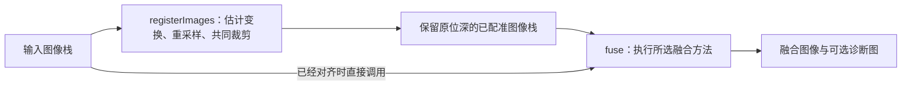

# 配准与多聚焦融合原理

本项目把配准和融合分成两个独立阶段：配准让同一结构落在相同坐标，融合从不同焦点的图像中组合清晰信息。当前提供 ECC、SIFT 两种配准方法，以及 GFF、拉普拉斯金字塔、DCT 块方差、DTCWT、GFG-FGF 五种融合方法，均由 C++ 和 OpenCV 执行，不加载 AI 模型。

本文以当前代码为准，说明计算流程、公式、参数和限制。调用示例见 [SDK 使用](sdk.md)，源码目录见 [算法模块导航](../algorithms/README.md)。

- [输入、输出与整体流程](#1-输入输出与整体流程)
- [配准原理](#2-配准原理)
- [融合共用的清晰度与权重计算](#3-融合共用的清晰度与权重计算)
- [五种融合方法](#4-五种融合方法)
- [诊断图与方法比较](#5-诊断图与方法比较)
- [源码与扩展入口](#6-源码与扩展入口)
- [参考来源与实现关系](#7-参考来源与实现关系)

## 1. 输入、输出与整体流程

### 1.1 三个公开入口



`registerAndFuse()` 顺序调用 `registerImages()` 和 `fuse()`，与显式两步调用使用相同的中间像素。

| 入口 | 输入要求与处理 | 返回内容 |
|---|---|---|
| `registerImages` | 同一批次、同尺寸图像；第一张作为参考 | `RegistrationResult.images`、`crop`、`transforms` |
| `fuse` | 调用者提供已经对齐的图像；仅执行融合 | `FusionResult.image`、`focus_indices`、`weights` |
| `registerAndFuse` | 先按配准设置处理，再按融合设置处理 | `PipelineResult.fusion`，以及 `crop`、`transforms` |

`fuse()` 不检查图像是否在几何上对齐，也不读取配准参数。组合调用默认 `RegistrationMethod::None`，因此需要显式开启配准。C++ 组合结果中的融合字段放在 `result.fusion`；Python 的组合结果是包含这些字段的平面字典。

### 1.2 类型、数值范围与所有权

所有入口要求：

- 至少两张二维图像，数量能用 `int32` 表示；宽、高均至少为 2。
- 所有图像的尺寸、深度、通道数相同，支持灰度和 BGR 三通道。
- 深度为 `CV_8U`、`CV_16U` 或 `CV_32F`；浮点值必须有限且位于 `[0, 1]`。
- 允许非连续 ROI；算法不修改输入。调用期间，调用者须保持输入有效，且不从其他线程修改它。

记原图为 $`X_i`$，归一化工作图为 $`I_i`$：

```math
I_i =
\begin{cases}
X_i/255, & \text{uint8} \\
X_i/65535, & \text{uint16} \\
X_i, & \text{float32}
\end{cases}
```

工作图分配为独立的 `CV_32F` 缓冲区。DTCWT 变换内部另用双精度，方法出口回到 `CV_32F`。融合完成后把像素裁到 `[0, 1]`，再恢复输入的深度和通道数；保持位深不等于保留输入像素值，重采样、加权和整数舍入都会改变数值。

独立配准同样恢复输入位深。因此整数图像在“配准 → 融合”之间经过一次量化；相较早期隐藏的全浮点贯通流程，结果可能有少量像素差异。当前组合入口与显式两步调用严格遵循同一约定。

## 2. 配准原理

配准对每张源图独立求解到第一张参考图的几何关系，不逐张串联变换。两种求解器共用灰度转换、工作分辨率、几何检查、重采样和裁剪流程。

### 2.1 方法与运动模型

`RegistrationMethod` 决定“怎样估计变换”，`MotionModel` 决定 ECC“允许怎样运动”。

| `method` | `motion_model` | 自由度与含义 | 返回矩阵 |
|---|---|---|---|
| `None` | 不使用 | 不估计、不重采样，返回独立副本 | 2×3 单位矩阵 |
| `Ecc` | `Translation` | 2：水平、垂直位移 | 2×3 |
| `Ecc` | `Affine` | 6：平移、旋转、缩放、剪切 | 2×3 |
| `Ecc` | `Homography` | 8：单应性，包含平面透视变化 | 3×3 |
| `Sift` | 不使用 | SIFT 匹配和 RANSAC，固定估计单应性 | 3×3 |

默认方法为 `None`，默认 ECC 模型为 `Translation`。SIFT 忽略 `motion_model` 的合法取值，但所有方法都会拒绝非法枚举。

用参考坐标 $`(x,y)`$ 表示源图采样位置 $`(x',y')`$，三个 ECC 模型分别为：

**平移模型：**

```math
\begin{aligned}
x' &= x+t_x \\
y' &= y+t_y
\end{aligned}
```

**仿射模型：**

```math
\begin{bmatrix}
x' \\
y'
\end{bmatrix}
= \begin{bmatrix}
a_{11} & a_{12} & t_x \\
a_{21} & a_{22} & t_y
\end{bmatrix}
\begin{bmatrix}
x \\
y \\
1
\end{bmatrix}
```

**单应性模型：**

```math
\begin{aligned}
x' &= \frac{h_{11}x+h_{12}y+h_{13}}{h_{31}x+h_{32}y+1} \\
y' &= \frac{h_{21}x+h_{22}y+h_{23}}{h_{31}x+h_{32}y+1}
\end{aligned}
```

允许更多自由度能描述更复杂的全局变化，也需要图像内容提供足够约束。单应性仍是一张全局变换，不能表达不同物体各自移动或明显的深度视差。

### 2.2 ECC：最大化图像相关性

ECC 直接比较参考图 $`T`$ 与变换后的源图 $`S(W_\theta(x))`$，调整运动参数 $`\theta`$ 提高相关性。把参与比较的像素减去各自均值，记为 $`\tilde{T}`$、$`\tilde{S}_\theta`$，其目标可写为：

```math
\begin{aligned}
\theta^* &= \arg\max_{\theta}\;\rho(\theta) \\
\rho(\theta) &=
\frac{\sum_{x\in\Omega_\theta}\tilde{T}(x)\tilde{S}_\theta(x)}
{\sqrt{\sum_{x\in\Omega_\theta}\tilde{T}(x)^2}
 \sqrt{\sum_{x\in\Omega_\theta}\tilde{S}_\theta(x)^2}}
\end{aligned}
```

$`\Omega_\theta`$ 表示当前变换下用于比较的有效位置。中心化与归一化降低了整体亮度偏移和增益变化的影响，但局部反光、失焦差异、饱和像素仍会改变匹配依据。迭代由 OpenCV `findTransformECC` 完成。[ECC 论文][ecc-paper]、[OpenCV 接口约定][opencv-ecc]。

本项目的执行步骤：

1. 转为归一化灰度图，并缩小到工作分辨率。
2. 参考图和源图各做一次 5×5、`sigma=1.2` 高斯平滑，使估计更多依赖共有结构。
3. 检查平滑后的标准差；小于 `1e-6` 或非有限时，按无纹理图像报错。
4. 每张源图从单位矩阵开始，在一个工作分辨率上优化。ECC 内部高斯窗口设为 1，避免重复平滑。
5. 拒绝 OpenCV 求解异常，以及非有限或不大于零的相关分数；通过后进入共用几何检查。

`iterations` 是迭代次数上限，`epsilon` 是相邻迭代相关系数变化的阈值，不是像素对齐误差。达到迭代上限、得到正相关分数或通过几何检查，都不能单独证明已经准确对齐。

当前实现适合初始位置已经接近、存在共同结构的图像。没有配准金字塔、外部初始矩阵，也没有“先 SIFT、再 ECC”的组合求解；大位移、严重失焦差异或错误局部极值仍可能导致失败或错误对齐。

### 2.3 SIFT 与 RANSAC：从对应点估计单应性

SIFT 在不同高斯平滑尺度下构建尺度空间，通过高斯差分（DoG）在空间和尺度上的局部极值寻找关键点，并剔除低对比度或沿边缘不稳定的候选点。随后根据邻域梯度确定主方向，在对应尺度和方向下统计 4×4 个子区域、每区 8 个方向的梯度直方图，形成 128 维描述子。尺度选择与方向归一化使同一局部结构在缩放、旋转后仍能产生相近的描述，从而更容易找到对应点。[OpenCV SIFT 原理](https://docs.opencv.org/4.12.0/da/df5/tutorial_py_sift_intro.html)、[Lowe 原论文](https://www.cs.ubc.ca/~lowe/papers/ijcv04.pdf)。

本项目通过这些关键点的对应关系求解单应性，使用 OpenCV 实现以下流程。[OpenCV 特征匹配与单应性示例][opencv-sift]。

1. 把工作灰度图临时转换为 8 位用于 SIFT；参考特征只提取一次。高位深原图仍保留给最终重采样。
2. 对每个参考描述子，在源图中寻找 L2 距离最近的两个描述子。
3. 只保留满足 $`d_1 < r\,d_2`$ 的匹配，其中 $`r`$ 对应参数 `match_ratio`。次近邻距离为零或距离非有限时丢弃。
4. 按描述子距离排序，去掉重复源特征及双方重复坐标，至少保留 6 个位置不重复的对应点。
5. RANSAC 从候选对应点中估计单应性，按工作图像上的重投影误差筛内点，再由 OpenCV 优化模型。
6. 至少需要 6 个内点，内点比例达到 `min_inlier_ratio`，并检查双方内点的空间分布。

对参考点 $`p_j`$ 和源图点 $`q_j`$，RANSAC 使用的误差是：

```math
e_j=\left\|\pi(Hp_j)-q_j\right\|_2
```

其中 $`\pi`$ 表示除以齐次坐标第三项。`ransac_threshold` 的单位是**工作分辨率像素**。RANSAC 使用 OpenCV 默认的 2000 次迭代上限和 0.995 置信度，不使用 ECC 的 `iterations`。

空间分布检查要求：内点坐标协方差的较小特征值至少为 $`1`$，且不小于较大特征值的 $`10^{-3}`$；凸包面积至少为 $`\max(16,10^{-4}WH)`$。这些条件用于拒绝集中在一点、很小区域或近似一条直线上的匹配。

有足够共同特征时，SIFT 可以估计比单位矩阵初始化的 ECC 更大范围的几何变化。严重失焦会减少共同特征，重复纹理可能产生一致但错误的匹配；内点比例高也不保证整幅图像都能由同一单应性准确描述。当前匹配采用单向两近邻筛选，没有额外的双向交叉匹配检查。

### 2.4 工作分辨率、矩阵方向与共同裁剪

**估计分辨率。** 令缩放比例为 $`\min(1,L_{\max}/\max(W,H))`$，其中 $`L_{\max}`$ 对应参数 `max_size`；横纵尺寸分别取整。不会放大小图；开启配准后，工作图的两边均须至少为 16，否则报错。

**坐标换算。** 内部求解器统一返回“参考工作坐标 → 源图工作坐标”的双精度 3×3 矩阵 $`H_{\mathrm{work}}`$。按 OpenCV resize 的像素中心约定，原图到工作图的映射为：

```math
\begin{aligned}
R &=
\begin{bmatrix}
s_x & 0 & (s_x-1)/2 \\
0 & s_y & (s_y-1)/2 \\
0 & 0 & 1
\end{bmatrix} \\
H &= R^{-1}H_{\mathrm{work}}R
\end{aligned}
```

这里 $`s_x=W_w/W`$、$`s_y=H_w/H`$ 使用取整后的真实比例，因此兼容奇数尺寸。几何检查会拒绝非有限、不可逆、方向翻转或投影分母在图像内接近零的矩阵。

**重采样。** 每张非参考图只在原始分辨率上执行一次双线性重采样，调用 `warpAffine` 或 `warpPerspective`，并设置 `WARP_INVERSE_MAP`。输出坐标沿 $`H`$ 查找源图位置：

```math
J_i(x,y)=I_i\!\left(\pi(H_i[x,y,1]^T)\right)
```

**去掉无效边缘。** 对全 1 浮点掩码执行相同的变换和插值；覆盖值至少为 `0.9999` 才视为有效。取所有输入有效掩码的交集，在其中寻找面积最大的轴对齐内接矩形。它不会包含插值混入边界补零的角落；矩形短边小于 8 时明确失败。

返回值的坐标约定：

- `crop` 位于**第一张原图**的坐标系中。
- `transforms[i]` 为 `CV_32F`，映射**参考原图坐标 → 第 i 张原图坐标**；第一张是单位变换。
- 配准输出图的像素 $`(u,v)`$ 对应参考原图 $`(u+c_x,v+c_y)`$，其中 $`c_x`$、$`c_y`$ 分别对应 `crop.x`、`crop.y`。先加裁剪偏移，再应用 `transforms[i]`；3×3 变换还需做齐次除法。
- `None` 返回整图 `crop` 和 2×3 单位矩阵，即使 `motion_model` 设为合法的 `Homography` 也一样。

矩阵没有隐含裁剪偏移，不能直接把裁剪后坐标代进去。求解失败会附带从 1 开始的图片序号，不会静默改用单位矩阵或其他方法。

### 2.5 配准参数

以下是 C++ `RegistrationOptions` 字段；所有字段均会校验，包括当前方法没有使用的字段。

| 字段 | 默认值 | 范围与作用 |
|---|---|---|
| `method` | `None` | `None`、`Ecc`、`Sift` |
| `motion_model` | `Translation` | `Translation`、`Affine`、`Homography`；仅 ECC 使用 |
| `iterations` | 150 | `[1, 10000]`；ECC 每张图的迭代上限 |
| `epsilon` | `1e-5` | 有限正数；ECC 相关系数变化阈值 |
| `max_size` | 1200 | `[16, 8192]`；两种方法共用的工作图最长边上限 |
| `max_features` | 4000 | `[64, 100000]`；SIFT 特征数上限 |
| `match_ratio` | 0.75 | 有限且在 `(0, 1)`；越小，最近邻筛选越严格 |
| `ransac_threshold` | 3.0 | 有限正数；工作分辨率下的重投影误差阈值 |
| `min_inlier_ratio` | 0.25 | 有限且在 `(0, 1]`；RANSAC 内点最低比例，同时至少 6 个内点 |

## 3. 融合共用的清晰度与权重计算

以下步骤由方法按需复用。GFF 和拉普拉斯金字塔共用全部清晰度流程；DCT 只复用决策与归一化工具；GFG-FGF 自行产生响应，再复用决策和引导权重；DTCWT 在复系数域独立执行。

下文记 $`I_i`$ 为第 $`i`$ 张归一化图像，$`g_i`$ 为评分或引导用的单通道图，$`M_w`$ 为 $`w\times w`$ 局部均值，$`N`$ 为输入张数。

### 3.1 清晰度指标与初始决策

GFF 和金字塔将 BGR 转灰度后评分，灰度输入直接使用原通道。可选指标为：

```math
S_i^{\mathrm{ML}}=M_w\left(\lvert D_{xx}g_i\rvert+\lvert D_{yy}g_i\rvert\right)
```

$`D_{xx}`$、$`D_{yy}`$ 分别用 `[-1, 2, -1]` 及其转置计算。两个方向先取绝对值再相加，避免正负抵消。

```math
S_i^{\mathrm{TG}}=M_w\left((\mathrm{Sobel}_x\,g_i)^2+
                           (\mathrm{Sobel}_y\,g_i)^2\right)
```

Tenengrad 使用 3×3 Sobel 核。两种指标均用局部均值减小零散决策，滤波边界采用 OpenCV 默认的 `BORDER_REFLECT_101`。较大窗口会把更宽的区域一起判断，因此可能跨过真实的焦点分界。

公共决策函数把近似并列的最大响应共同选中：

```math
\begin{aligned}
m_i(x) &= \mathbf{1}\!\left[S_i(x)\ge \max_j S_j(x)-10^{-8}\right] \\
P_i(x) &= \frac{m_i(x)}{\sum_j m_j(x)}
\end{aligned}
```

平坦区域等权，不强制选择第一张。这个规则也用于 DCT 的块方差和 GFG-FGF 的响应；DTCWT 使用自己的复系数选择规则。

`FocusOptions` 的默认值和约束：

| 字段 | 默认值 | 范围与作用 |
|---|---|---|
| `measure` | `ModifiedLaplacian` | 改进拉普拉斯；也可选 `Tenengrad` |
| `window` | 9 | `[1, 255]` 内的奇数；清晰度局部均值窗口边长，单位为像素 |

`guided_filter.focus` 与 `laplacian_pyramid.focus` 是两份独立配置，修改其中一份不会改变另一份。

### 3.2 引导滤波与权重归一化

引导滤波用图像结构约束决策图的平滑。对引导图 $`g`$、待滤波图 $`p`$，在每个半径为 $`r`$ 的窗口内估计局部线性模型：

```math
\begin{aligned}
a &= \frac{M_{2r+1}(gp)-M_{2r+1}(g)M_{2r+1}(p)}
          {M_{2r+1}(g^2)-M_{2r+1}(g)^2+\epsilon} \\
b &= M_{2r+1}(p)-aM_{2r+1}(g)
\end{aligned}
```

```math
\mathrm{GF}(g,p;r,\epsilon)=M_{2r+1}(a)\,g+M_{2r+1}(b)
```

$`\epsilon`$ 抑制局部斜率过大，单位与归一化强度的平方一致。实现调用 `cv::ximgproc::guidedFilter`，输出深度为 `CV_32F`，在完整分辨率上计算；依赖 opencv_contrib 的 `ximgproc`。[原论文][guided-paper]、[OpenCV 接口][opencv-guided]。

作为权重使用时，先把滤波结果裁到 `[0, 1]`，再跨候选图像归一化：

```math
W_i=\frac{\max(w_i,0)}{\sum_j\max(w_j,0)}
```

若分母不大于 `1e-12`，该位置对当前候选图像均分权重。GFG-FGF 的第一遍滤波处理的是响应，允许负值；到第二遍生成权重时才裁剪。

当前所有融合引导滤波正则项须在 `[1e-6, FLT_MAX]` 内。此限制来自官方 float32 实现的数值范围：过小的正则项可能在协方差相减时被舍去，过大则转换溢出。它不适用于 ECC 的 `epsilon`。Qt 提供 `[1e-6, 1]` 的常用调节范围，核心接口允许到 `FLT_MAX`。

官方引导滤波使用端点重复的 `BORDER_REFLECT`，与清晰度滤波的默认边界不同；也与早期手写引导滤波的 `BORDER_REFLECT_101` 不同，所以边界输出不承诺与旧实现逐位一致。

## 4. 五种融合方法

`FusionOptions.method` 默认 `GuidedFilter`。每种方法只接收、校验自己的参数组，未选中配置中的无效值不会影响当前计算。`keep_weight_maps` 默认为 `false`，只控制是否保留方法提供的权重诊断。

### 4.1 GFF：基础层与细节层分别融合

源码：[guided_filter.cpp](../algorithms/src/fusion/guided_filter/guided_filter.cpp)。配置：`FusionOptions.guided_filter`。

先按第 3 节生成清晰度决策 $`P_i`$，再分解输入：

```math
\begin{aligned}
B_i &= M_{2r_b+1}(I_i) \\
D_i &= I_i-B_i
\end{aligned}
```

基础层 $`B_i`$ 保存缓慢变化的色调，细节层 $`D_i`$ 保存局部变化。分别用两组引导参数优化同一决策图，裁剪、归一化后得到 $`W_i^B`$、$`W_i^D`$：

```math
\begin{aligned}
W_i^B &= \mathcal{N}\!\left(\mathrm{clip}(\mathrm{GF}(g_i,P_i;r_b,\epsilon_b))\right) \\
W_i^D &= \mathcal{N}\!\left(\mathrm{clip}(\mathrm{GF}(g_i,P_i;r_d,\epsilon_d))\right)
\end{aligned}
```

```math
F=\sum_i W_i^B B_i+\sum_i W_i^D D_i
```

这里 $`\mathcal{N}`$ 表示跨输入归一化。同一组标量权重应用于全部 BGR 通道。`base_radius` 同时控制基础层均值分解和基础权重滤波；细节权重有独立的半径与正则项。

| 字段 | 默认值 | 范围与作用 |
|---|---|---|
| `focus` | 第 3.1 节默认值 | 本方法独立的清晰度配置 |
| `base_radius` | 15 | `[1, 255]`；基础层与基础权重窗口半径 |
| `detail_radius` | 3 | `[1, 255]`；细节权重窗口半径 |
| `base_epsilon` | 0.01 | `[1e-6, FLT_MAX]`；基础权重正则项 |
| `detail_epsilon` | 0.0001 | `[1e-6, FLT_MAX]`；细节权重正则项 |

该方法可以分别调整色调过渡和细节选择，但仍依赖清晰度评分。强噪声会产生高频响应，错误对齐会把边缘混合成重影，较宽的权重过渡可能在焦点边界形成光晕。其分层思想参考 OpenFocus GFF，本项目使用自己的清晰度指标、并列处理和位深约定，不承诺逐项复现论文或上游输出。

### 4.2 拉普拉斯金字塔：分尺度融合频带

源码：[laplacian_pyramid.cpp](../algorithms/src/fusion/laplacian_pyramid/laplacian_pyramid.cpp)。配置：`FusionOptions.laplacian_pyramid`。这是本项目额外提供的方法。

先生成全分辨率细节权重 $`W_i^0`$。图像和权重分别通过 `pyrDown` 构建高斯金字塔：

```math
\begin{aligned}
G_i^0 &= I_i \\
G_i^{k+1} &= \mathrm{down}(G_i^k) \\
W_i^{k+1} &= \mathrm{down}(W_i^k)
\end{aligned}
```

非最粗层的拉普拉斯频带为：

```math
L_i^k=G_i^k-\mathrm{up}(G_i^{k+1})
```

最粗层直接使用 $`L_i^{K-1}=G_i^{K-1}`$。每层按实际权重和融合：

```math
\begin{aligned}
\bar{L}^k &= \frac{\sum_i W_i^k L_i^k}{\max(\sum_i W_i^k,10^{-12})} \\
F^{K-1} &= \bar{L}^{K-1} \\
F^k &= \mathrm{up}(F^{k+1})+\bar{L}^k
\end{aligned}
```

最后取 $`F^0`$。每层显式记录尺寸，奇数宽高向上取整下采样，重建时恢复准确尺寸。逐张构建和累加图像金字塔，避免同时持有全部输入的金字塔。

| 字段 | 默认值 | 范围与作用 |
|---|---|---|
| `focus` | 第 3.1 节默认值 | 本方法独立的清晰度配置 |
| `detail_radius` | 3 | `[1, 255]`；全分辨率细节权重半径 |
| `detail_epsilon` | 0.0001 | `[1e-6, FLT_MAX]`；细节权重正则项 |
| `levels` | 5 | `[1, 16]`；总层数上限，包含最粗层 |

短边不大于 2 时停止继续下采样。`levels=1` 时没有频带分解，直接按全分辨率权重加权。清晰度只在原分辨率计算一次，各层使用下采样的权重，**不会每层重新判断焦点**。粗层权重覆盖更宽的空间区域，可能混合不同来源的低频信息。

### 4.3 DCT：按块方差选图并检查一致性

源码：[dct.cpp](../algorithms/src/fusion/dct/dct.cpp)。配置：`FusionOptions.dct`。

接口沿用 OpenFocus 的 `Dct` 标识，实际实现是**空间域块方差融合**。它没有显式计算或融合 DCT 系数。对灰度块 $`B`$：

```math
V_i(B)=\frac{1}{\lvert B\rvert}\sum_{x\in B}(g_i(x)-\mu_i(B))^2
```

若对该块采用正交归一化 DCT，Parseval 等式给出：

```math
V_i(B)=\frac{1}{\lvert B\rvert}\sum_{(u,v)\ne(0,0)} \lvert C_i(u,v)\rvert^2
```

其中 $`C_i(u,v)`$ 为块的 DCT 系数，$`(0,0)`$ 为直流（DC）项，求和遍历块内其余频率位置。因此方差可以表示块的交流能量，但不包含频率方向或不同频带的独立选择。

执行步骤：

1. 按非重叠方块计算方差，右侧、下侧不足整块的区域按真实大小参与统计。
2. 用公共决策规则选方差最大的块；平坦或近似并列块均分权重。
3. 取得块来源标签，对 `int32` 标签图做两次中值滤波，边界复制。
4. 原始决策有唯一首选的块采用中值结果；原本并列的块保留等权。
5. 按真实块边界展开权重，计算 $`F=\sum_i W_iI_i`$。

| 字段 | 默认值 | 范围与作用 |
|---|---|---|
| `block_size` | 8 | `[2, 128]`；非重叠块边长，单位为像素 |
| `consistency_window` | 7 | `[1, 31]` 内的奇数；两次中值窗口边长，单位为**块**；1 关闭平滑 |

默认一致性窗口覆盖最多 7×7 个相邻块，并非 7×7 像素。选图边界受块网格限制，较小的清晰区域可能被合并；标签中值按输入序号的数值顺序统计，多帧重排可能改变结果。当前实现保留奇数边缘、原始位深及超过 256 帧的索引，并修正了上游在这些方面的限制。

### 4.4 DTCWT：多尺度六方向复小波融合

源码：[dtcwt.cpp](../algorithms/src/fusion/dtcwt/dtcwt.cpp) 与 [transform.cpp](../algorithms/src/fusion/dtcwt/transform.cpp)。配置：`FusionOptions.dtcwt`。

本方法执行真正的二维双树复小波变换：

- 首层使用 `near_sym_a` 的 5/7 抽头近对称双正交滤波器。
- 后续层使用 `qshift_a` 的 10 抽头 Q-shift 滤波器，两棵相位树沿两个维度形成四棵实树。
- 三组实高频各组合成两个复方向，每层共六个方向，约对应 $`\pm15^\circ,\pm45^\circ,\pm75^\circ`$。

例如四个交错实相位 $`a,b,c,d`$ 的方向组合为：

```math
\begin{aligned}
z_+ &= \frac{(a-d)+\mathrm{i}(b+c)}{\sqrt{2}} \\
z_- &= \frac{(a+d)+\mathrm{i}(b-c)}{\sqrt{2}}
\end{aligned}
```

这些组合与双树滤波器组一起提供方向选择性；保留全部系数时可通过逆变换重建输入。数学、滤波器数值来源及独立实现约定见 [DTCWT 滤波器说明](../algorithms/src/fusion/dtcwt/FILTERS.md)。

记最粗低频为 $`L_i`$，第 $`k`$ 层、第 $`d`$ 个方向的复系数为 $`C_i^{k,d}`$。低频取所有输入的算术均值：

```math
\bar{L}=\frac{1}{N}\sum_i L_i
```

高频逐对合并。对累计系数 $`A`$ 和下一张的系数 $`B`$，在同一方向的子带窗口 $`\omega`$ 中：

```math
\begin{aligned}
E_A(x) &= \max_{u\in\omega_x}\lvert A(u)\rvert \\
E_B(x) &= \max_{u\in\omega_x}\lvert B(u)\rvert \\
m(x) &= \mathbf{1}\!\left[E_A(x)>E_B(x)\right]
\end{aligned}
```

```math
\begin{aligned}
\hat{m}(x) &= \mathbf{1}\!\left[\sum_{u\in\omega_x}m(u)>\frac{\lvert\omega\rvert}{2}\right] \\
C(x) &=
\begin{cases}
A(x), & \hat{m}(x)=1 \\
B(x), & \hat{m}(x)=0
\end{cases}
\end{aligned}
```

最大值窗口使用端点重复的反射边界，多数投票的窗口外取零。选择完整复数，保留幅值与相位；初始活动度相等时不投票给累计输入，最终来源由邻域多数决定。随后从 $`\bar{L}`$ 和融合后的全部高频逆变换重建。

| 字段 | 默认值 | 范围与作用 |
|---|---|---|
| `levels` | 4 | `[1, 16]`；最大分解层数，小图自动限制 |
| `activity_window` | 3 | `[1, 31]` 内的奇数；同时用于最大活动度和多数投票，单位为当前子带采样点 |

原图奇数维在底部或右侧重复一个采样；后续低频尺寸不足四的倍数时，在对应维两端各补一点。逐层记录并撤销延拓，输出回到原始尺寸。任一维低频只剩两个采样点时停止继续分解。内部使用双精度有限支撑滤波和转置合成，不建立与边长平方成正比的大矩阵，也不调用 Python `dtcwt`。

三张及以上输入的高频按原顺序逐对合并，所以结果可能随输入顺序改变。BGR 各通道独立变换和选系数，可能从不同图像选择颜色细节。此方法没有能代表全部尺度、方向、通道贡献的单张空间权重或来源图，诊断字段为空。

### 4.5 GFG-FGF：筛帧后进行两阶段引导滤波

源码：[gfgfgf.cpp](../algorithms/src/fusion/gfgfgf/gfgfgf.cpp)。配置：`FusionOptions.gfgfgf`。

灰度图直接作为引导。彩色图沿用 OpenFocus 策略：选第一张图像中全图像素和最大的 B/G/R 通道，所有帧固定使用该通道评分和引导，最终权重仍作用于全部颜色通道。

**第一步：全局梯度筛帧。**

```math
\begin{aligned}
s_i &= \mathrm{mean}_{\Omega}
\left[(\mathrm{Scharr}_x\,g_i)^2+
      (\mathrm{Scharr}_y\,g_i)^2\right] \\
\mathcal{S} &= \left\{i:s_i\ge\alpha\max_j s_j\right\}
\end{aligned}
```

Scharr 使用 `BORDER_REFLECT`；常规尺寸的统计区域去掉一圈边界，2 像素窄图使用全图。所有分数为零时保留全部输入，`selection_ratio=0` 同样保留全部。

**第二步：生成局部差异响应。**

```math
\begin{aligned}
\Delta_i(x) &= \left\lvert g_i(x)-M_w(g_i)(x)\right\rvert \\
d_i(x) &=
\begin{cases}
\Delta_i(x), & \Delta_i(x)>\tau \\
0, & \Delta_i(x)\le\tau
\end{cases} \\
R_i &= \mathrm{GF}(g_i,d_i;r,\epsilon)
\end{aligned}
```

局部均值使用 OpenCV 默认边界。第一遍引导滤波输出允许负值，不能提前裁成权重；只在保留帧之间比较响应，避免被筛除帧的零占位压过负响应。

**第三步：细化决策并融合。** 由 $`R_i`$ 生成近似并列等权的决策 $`P_i`$，再执行：

```math
\begin{aligned}
W_i &= \mathcal{N}\!\left(\mathrm{clip}(\mathrm{GF}(g_i,P_i;r,\epsilon))\right) \\
F &= \sum_{i\in\mathcal{S}} W_i I_i
\end{aligned}
```

两遍引导滤波共用参数，均使用官方完整分辨率实现。上游缺少 `ximgproc` 时的降采样后备路径没有引入本项目。

| 字段 | 默认值 | 范围与作用 |
|---|---|---|
| `difference_window` | 7 | `[1, 255]` 内的奇数；局部均值窗口边长 |
| `selection_ratio` | 0.15 | 有限且在 `[0, 1]`；全局梯度筛帧比例 |
| `difference_threshold` | 0.005 | 有限且在 `[0, 1]`；归一化局部差异阈值 |
| `guided_radius` | 5 | `[1, 255]`；两遍滤波共用半径，单位为像素 |
| `guided_epsilon` | 0.3 | `[1e-6, FLT_MAX]`；两遍滤波共用正则项 |

全局梯度弱但包含一小块重要清晰区域的图像可能被筛除；`selection_ratio=0` 可以禁用筛帧。首图选通道策略可能忽略其他通道才显著的纹理，曝光或色偏差异也会影响评分。完全无纹理时保留全部帧并等权融合。诊断图为筛除帧保留原位置、权重置零，不重新编号。

## 5. 诊断图与方法比较

### 5.1 返回的诊断代表什么

`focus_indices` 若非空，为与结果同尺寸的 `CV_32SC1` 图，保存**从零开始的原始输入序号**。`weights` 若提供，为按原输入顺序排列的 `CV_32FC1` 图。`keep_weight_maps=false` 不保留权重列表，但不会关闭方法提供的来源索引。

| 方法 | `weights` 的含义 | `focus_indices` 的含义 |
|---|---|---|
| GFF | 归一化的全分辨率**细节层**权重 | 细节权重最大者 |
| 拉普拉斯金字塔 | 构建权重金字塔前的全分辨率细节权重 | 该权重最大者 |
| DCT | 展开到像素的最终块选择权重，并列块可等权 | 最终权重最大者 |
| DTCWT | 始终为空 | 始终为空 |
| GFG-FGF | 最终归一化融合权重；被筛除帧为零 | 最终权重最大的原始输入序号 |

最大权重并列时索引取较小序号。这只是稳定的显示约定：**索引为 0 不意味着该位置没有平均其他输入**。这些图也不表示置信度、焦点距离或物理深度。

GFF 的诊断没有包含基础层权重；金字塔诊断没有完整表达各尺度的贡献。如果二者采用相同的输入、清晰度和细节权重参数，诊断图相同，融合图仍由不同的重建流程决定。Python 将 DTCWT 的空来源图映射为 `None`，权重为 `[]`。

### 5.2 根据流程特点比较

下表描述当前实现的差异；质量仍需用实际图像判断，没有固定的优劣排序。

| 方法 | 主要判断依据 | 重建方式 | 需要重点检查的情况 |
|---|---|---|---|
| GFF | 全分辨率局部清晰度 | 基础层、细节层两组权重 | 焦点分界的光晕、纹理与噪声的混淆 |
| 拉普拉斯金字塔 | 全分辨率清晰度，逐层平滑权重 | 多尺度频带融合 | 粗尺度跨区域混合、较小清晰区域 |
| DCT | 非重叠块的灰度方差 | 按块选择后直接加权 | 块边界、小于块或一致性窗口的细节 |
| DTCWT | 各尺度、方向的复系数幅值 | 低频均值、六方向系数逆变换 | 输入顺序、颜色通道选择、复系数内存 |
| GFG-FGF | 全局梯度与局部差异响应 | 筛帧、两遍引导滤波后直接加权 | 少量局部清晰信息被筛除、首图选通道 |

共同限制：

- 融合假设像素已经对应同一场景位置。局部形变、物体运动、明显视差无法由现有全局配准完整解决。
- 当前没有曝光均衡、颜色校正、噪声模型或失焦成像模型；高对比度、噪声、反光也可能被当作清晰细节。
- 输入栈及归一化栈驻留内存，部分方法还保留逐图评分和权重。金字塔与 DTCWT 会及时释放用完的中间系数，但没有整套图像栈的磁盘缓存或分块执行。
- 取消发生在进度报告点，不会中断正在运行的单次 OpenCV 求解或滤波。回调返回 `false` 抛出 `Cancelled`；回调自己的异常原样传播。
- 合成测试验证几何、恒等、数值范围和互补焦点等性质，不能替代真实采集条件下的质量评价。测试范围见 [验证记录](verification.md)。

## 6. 源码与扩展入口

| 职责 | 主要位置 |
|---|---|
| 输入检查、归一化与灰度 | `algorithms/src/common/` |
| 配准分派、坐标换算与共同裁剪 | `algorithms/src/registration/registration.cpp` |
| ECC / SIFT 求解 | `registration/ecc.cpp`、`registration/sift_homography.cpp` |
| 融合分派、恢复位深与结果整理 | `algorithms/src/fusion/fusion.cpp` |
| 按需复用的评分、引导滤波、权重 | `algorithms/src/fusion/common/` |
| 五种方法及各自私有步骤 | `fusion/guided_filter/`、`laplacian_pyramid/`、`dct/`、`dtcwt/`、`gfgfgf/` |
| 配准与融合的顺序组合 | `algorithms/src/pipeline.cpp` |

新增融合方法时：

1. 在 `include/mif/fusion/` 增加独立配置类型，并在 `FusionOptions` 中增加参数组和方法枚举。
2. 在 `src/fusion/` 新建方法目录，提供自己的参数校验与执行函数；只接收该方法的配置。
3. 返回 `MethodResult`：`image` 必须为与输入同尺寸、同通道的 `CV_32F`；诊断字段按方法实际含义提供，允许为空。
4. 接入 `fusion.cpp` 的校验、执行分派，登记构建和测试；有界面或 Python 支持时再补对应参数入口。

新方法无需经过公共清晰度或引导滤波流程，也无需制造一张没有明确含义的权重图。方法内部负责进度与取消检查，公共入口负责裁剪数值范围、恢复位深及搬运结果。

新增配准估计器时，按内部 `Estimator` 接口返回**参考工作坐标 → 源图工作坐标**的 `CV_64F` 3×3 矩阵。参数校验与方法分派需要同步增加；已有坐标换算、几何检查、重采样和公共裁剪可继续复用。

## 7. 参考来源与实现关系

### 7.1 参考项目

传统融合参考版本为 OpenFocus 提交 `bf3a3a15c1c508fbba117f6e98a64e49a087434e`，核对日期为 2026-09-29。

- [OpenFocus 项目](https://github.com/Xinzhe99/OpenFocus)：传统方法组织和使用流程；不作为运行依赖。
- [GFF](https://github.com/Xinzhe99/OpenFocus/blob/bf3a3a15c1c508fbba117f6e98a64e49a087434e/fusion_methods/gff.py)：基础层、细节层及分别细化权重的思路。本项目改用可配置清晰度指标、近似并列等权及统一位深约定。
- [DCT](https://github.com/Xinzhe99/OpenFocus/blob/bf3a3a15c1c508fbba117f6e98a64e49a087434e/fusion_methods/dct.py)：空间域块方差与两次标签中值。本项目补齐完整边缘、`int32` 索引、并列等权及高位深输出。
- [DTCWT](https://github.com/Xinzhe99/OpenFocus/blob/bf3a3a15c1c508fbba117f6e98a64e49a087434e/fusion_methods/dtcwt.py)：低频均值、高频最大活动度与多数一致性规则。本项目独立实现可逆双树引擎，并处理奇数尺寸和有效层数。
- [GFG-FGF](https://github.com/Xinzhe99/OpenFocus/blob/bf3a3a15c1c508fbba117f6e98a64e49a087434e/fusion_methods/gfg_fgf.py)：梯度筛帧、局部差异和两阶段官方引导滤波路径。本项目补齐灰度、高位深、小图、无纹理等权与原始输入索引。
- [配准参考](https://github.com/Xinzhe99/OpenFocus/blob/455e0f0217e93e5df45fbaeb7a9bb94c9649f22a/core/registration.py)：SIFT/RANSAC 与 ECC 两种路线。本项目直接配准到第一张图，共用有效掩码裁剪，并明确报告失败；没有实现其组合求解模式。

拉普拉斯金字塔是本项目额外实现的方法。上述关系说明参考范围，不承诺与上游 Python 输出逐像素相同。OpenFocus 的完整 MIT 声明见 [THIRD_PARTY_NOTICES.md](../THIRD_PARTY_NOTICES.md)。

### 7.2 数学与官方接口

- G. D. Evangelidis、E. Z. Psarakis，[*Parametric Image Alignment Using Enhanced Correlation Coefficient Maximization*][ecc-paper]，IEEE TPAMI 30(10)，2008，1858–1865：ECC 目标与迭代求解。
- [OpenCV 4.12 ECC][opencv-ecc]：运动模型、终止条件和 `WARP_INVERSE_MAP` 使用约定。
- [OpenCV 4.12 特征匹配与单应性][opencv-sift]：SIFT 描述子筛选和 RANSAC 单应性接口。
- K. He、J. Sun、X. Tang，[*Guided Image Filtering*][guided-paper]，ECCV 2010：引导滤波局部线性模型。
- [OpenCV 4.12 引导滤波][opencv-guided]：本项目实际调用的 `ximgproc::guidedFilter`。
- S. Li、X. Kang、J. Hu，*Image fusion with guided filtering*，IEEE TIP 22(7)，2013，2864–2875：OpenFocus GFF 引用的分层融合文献。
- N. Kingsbury，[*Complex Wavelets for Shift Invariant Analysis and Filtering of Signals*](https://doi.org/10.1006/acha.2000.0343)，ACHA 10(3)，2001，234–253：双树与 Q-shift 设计。
- J. J. Lewis 等，[*Pixel- and region-based image fusion with complex wavelets*](https://research-information.bris.ac.uk/en/publications/pixel-and-region-based-image-fusion-with-complex-wavelets)，Information Fusion 8(2)，2007，119–130：OpenFocus DTCWT 引用的复小波融合文献。
- 付宏语等，[*多聚焦显微图像融合算法*](https://www.researching.cn/ArticlePdf/m00002/2024/61/6/0618022.pdf)，《激光与光电子学进展》61(6)，2024，0618022：OpenFocus GFG-FGF 引用的文献；本项目流程以该项目实际代码及本文列明的差异为准。

DTCWT 滤波器数据和参考程序许可边界另见 [FILTERS.md](../algorithms/src/fusion/dtcwt/FILTERS.md)。Python `dtcwt` 仅用于开发时独立数值对照，不是本项目依赖，参考库的受限程序代码未引入本项目。

[ecc-paper]: https://ieeexplore.ieee.org/document/4515873/
[opencv-ecc]: https://docs.opencv.org/4.12.0/dc/d6b/group__video__track.html
[opencv-sift]: https://docs.opencv.org/4.12.0/d1/de0/tutorial_py_feature_homography.html
[guided-paper]: https://people.csail.mit.edu/kaiming/publications/eccv10guidedfilter.pdf
[opencv-guided]: https://docs.opencv.org/4.12.0/da/d17/group__ximgproc__filters.html

