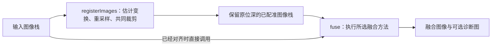

# 配准与多聚焦融合原理

拍摄同一个场景时，一张照片可能前景清晰、背景模糊，另一张则相反。多聚焦融合希望把它们各自清晰的部分组合起来，得到一张更多区域清晰的图像。

本项目分两步完成这件事：

1. **配准：先把位置对齐。** 让不同照片中的同一个物体落在相同坐标，减少移动、旋转或缩放带来的错位。
2. **融合：再组合清晰内容。** 比较对应区域的细节，决定各张照片贡献多少，最后生成结果。

当前提供 ECC、SIFT 两种配准方法，以及 GFF、拉普拉斯金字塔、DCT 块方差、DTCWT、GFG-FGF 五种融合方法，均由 C++ 和 OpenCV 执行。

**阅读顺序：** 初次了解原理，可以先读第 3 节的基础知识，再看第 4 节各方法的步骤；需要处理图像错位时读第 2 节。公式用于说明这些步骤怎样计算，参数表用于对照代码。部分数值和边界约定放在可展开的“实现细节”中。

本文描述当前代码的实际行为。调用示例见 [SDK 使用](sdk.md)，源码目录见 [算法目录](architecture.md#算法目录)。

- [输入、输出与整体流程](#1-输入输出与整体流程)
- [配准原理](#2-配准原理)
- [融合前的基础知识](#3-融合前的基础知识)
- [五种融合方法](#4-五种融合方法)
- [诊断图与方法比较](#5-诊断图与方法比较)
- [源码与扩展入口](#6-源码与扩展入口)
- [参考来源与实现关系](#7-参考来源与实现关系)

## 1. 输入、输出与整体流程

### 1.1 三个公开入口

这里把按顺序传入的一组图像称为“图像栈”。如果照片存在位移、旋转等变化，先配准再融合；如果已经对齐，可以直接融合。



项目提供三个入口，分别对应只配准、只融合和连续完成两步：

| 入口 | 做什么 | 返回内容 |
|---|---|---|
| `registerImages` | 以第一张图为参考，对齐同一批图像，并保留共同有效区域 | 已对齐图像 `images`、裁剪区域 `crop_region`、变换矩阵 `transforms`，位于 `RegistrationResult` 中 |
| `fuse` | 从已对齐图像中组合清晰信息 | 融合图 `image`，以及方法提供的来源图 `source_index_map`、权重图 `weight_maps`，位于 `FusionResult` 中 |
| `registerAndFuse` | 依次调用上述两个入口 | `PipelineResult.fusion` 保存融合结果，另有配准产生的 `crop_region`、`transforms` |

`fuse()` 接收的图像应由调用者事先对齐；它不会检查几何对齐情况，也不读取配准参数。`registerAndFuse()` 默认使用 `NoRegistrationOptions` 跳过配准，需要配准时传入 `EccRegistrationOptions` 或 `SiftRegistrationOptions`。

组合入口与手动先调用 `registerImages()`、再把其 `images` 交给 `fuse()` 的结果一致。C++ 通过 `result.fusion` 读取融合字段；Python 把融合字段、`crop_region` 和 `transforms` 放在同一个字典中，没有额外的 `fusion` 层。

### 1.2 类型、数值范围与所有权

三个入口采用相同的输入要求：

- 至少两张二维图像，数量能用 `int32` 表示；每张图的宽、高均至少为 2 像素。
- 同一批图像的尺寸、像素数据类型和通道数相同。支持单通道灰度图，以及通道顺序为蓝、绿、红的 BGR 三通道图。
- 像素数据类型为 `CV_8U`（8 位无符号整数）、`CV_16U`（16 位无符号整数）或 `CV_32F`（32 位浮点数）。浮点输入必须位于 `[0, 1]`，且不能含无穷大或 `NaN`。
- 可以传入原图的一块 ROI（感兴趣区域），不要求其所有像素在内存中连续排列。算法不修改输入；调用期间，调用者须保持输入缓冲区有效，且不从其他线程修改它。

**计算时统一数值范围。** 为了让同一组参数能处理不同位深的图像，算法先把输入转换成 `[0, 1]` 范围的浮点工作图。记原图为 $`X_i`$，工作图为 $`I_i`$：

```math
I_i =
\begin{cases}
X_i/255, & \text{uint8} \\
X_i/65535, & \text{uint16} \\
X_i, & \text{float32}
\end{cases}
```

这里按数据类型的最大值缩放，不会根据每张图的最小、最大像素重新拉伸对比度。工作图使用独立的 `CV_32F` 缓冲区；DTCWT 的变换内部使用双精度，方法返回时再转换成 `CV_32F`。使用 `NoRegistrationOptions` 跳过配准时只复制原图，不做这一步转换。

**输出恢复输入的数据类型。** 融合完成后，先把越界像素裁到 `[0, 1]`，再恢复输入的位深和通道数。例如，8 位输入的输出仍为 8 位，但重采样、加权和整数舍入可能改变像素值。

独立配准也会恢复输入位深。因此，整数图像在“配准 → 融合”之间会先舍入成整数，这一步称为量化。与早期始终保留浮点中间结果的流程相比，输出可能有少量像素差异；当前组合入口与显式两步调用使用相同的中间像素。

返回的图像拥有独立于输入的缓冲区，可以在函数返回后继续使用。复制结果结构时，OpenCV 的 `cv::Mat` 默认共享结果数据；需要互不影响的可写副本时，应对图像调用 `clone()`。

## 2. 配准原理

配准的目标是让同一处物体在各张图中落到相同坐标。例如，同一根细线在两张图中相差几个像素，直接融合可能产生重影；配准先估计这种位置差异，再把图像对齐。

本项目始终以**第一张图作为参考图**，其余称为源图。每张源图都直接与参考图比较，不使用“第二张对齐第一张、第三张再对齐第二张”的串联方式。ECC 和 SIFT 估计变换的方法不同，但共用灰度转换、工作分辨率、几何检查、重采样和裁剪流程。

### 2.1 方法与运动模型

**参数类型决定配准方法**：`EccRegistrationOptions` 选择灰度相关性优化，`SiftRegistrationOptions` 选择局部特征匹配。`MotionModel` 只属于 ECC 参数，决定它**允许怎样改变图像位置和形状**：只移动，还是同时允许旋转、缩放和透视变化。

表中的“自由度”是需要求出的独立参数个数。例如，平移只需要水平位移和垂直位移两个参数。

| 参数类型 | `motion_model` | 自由度与含义 | 返回矩阵 |
|---|---|---|---|
| `NoRegistrationOptions` | 不包含 | 不估计、不重采样，返回独立副本 | 2×3 单位变换 |
| `EccRegistrationOptions` | `Translation` | 2：水平、垂直位移 | 2×3 |
| `EccRegistrationOptions` | `Affine` | 6：平移、旋转、缩放、剪切；直线的平行关系保持不变 | 2×3 |
| `EccRegistrationOptions` | `Homography` | 8：单应性，可描述平面因视角变化产生的透视形变 | 3×3 |
| `SiftRegistrationOptions` | 不包含 | SIFT 匹配和 RANSAC，固定估计单应性 | 3×3 |

默认跳过配准，ECC 参数的默认模型为 `Translation`。ECC 会拒绝非法模型枚举；SIFT 参数中没有 `motion_model`，因此不需要设置或保留一个无关模型。

允许更多自由度能描述更复杂的变化，但也需要更多可靠的图像信息来约束这些参数。单应性仍然对整张图使用同一个变换，无法分别描述不同物体的运动，也不能消除明显的深度视差，即近处和远处物体因视角变化而产生的不同位移。

**三个运动模型的坐标公式：**

本项目用参考图的坐标 $`(x,y)`$ 查找源图中的采样位置 $`(x',y')`$。三个 ECC 模型分别为：

**平移模型：**

```math
\begin{aligned}
x' &= x+t_x \\
y' &= y+t_y
\end{aligned}
```

**仿射模型：**

```math
\begin{bmatrix}
x' \\
y'
\end{bmatrix}
= \begin{bmatrix}
a_{11} & a_{12} & t_x \\
a_{21} & a_{22} & t_y
\end{bmatrix}
\begin{bmatrix}
x \\
y \\
1
\end{bmatrix}
```

**单应性模型：**

```math
\begin{aligned}
x' &= \frac{h_{11}x+h_{12}y+h_{13}}{h_{31}x+h_{32}y+1} \\
y' &= \frac{h_{21}x+h_{22}y+h_{23}}{h_{31}x+h_{32}y+1}
\end{aligned}
```

其中，$`t_x,t_y`$ 表示位移；$`a_{11}`$ 等系数共同描述仿射形变；单应性矩阵最后一个系数已归一化为 1，所以剩余 8 个独立参数。SIFT 使用的也是这一单应性模型。


### 2.2 ECC：最大化图像相关性

ECC 可以理解为：不断微调源图的位置或形状，寻找灰度变化与参考图最一致的变换。它直接比较图像像素，不先提取特征点。

这里的**相关性**衡量两张图的明暗变化是否一起发生。例如，参考图中从暗到亮的边缘，在变换后的源图里也出现在相同位置，相关性通常会提高。相关系数的理论范围是 `[-1, 1]`，越接近 1，参与比较的灰度变化越一致；它不是“已经对齐多少像素”的比例。

本项目按以下步骤执行：

1. **准备灰度工作图。** 把输入转换到 `[0, 1]`，并在需要时缩小图像。用于估计的分辨率见第 2.4 节。
2. **减弱细碎差异。** 对参考图和源图各做一次 5×5、`sigma=1.2` 的高斯平滑，让估计更多地依赖两图共有的结构。
3. **检查是否有可比较的变化。** 平滑后灰度的标准差小于 `1e-6`，或标准差非有限时，按无纹理图像报错。常量图无法提供可靠的位置线索。
4. **迭代调整变换。** 每张源图都从单位变换开始，即先假设它与参考图处于相同位置。在这一个工作分辨率上调用 OpenCV `findTransformECC`；其内部高斯窗口设为 1，避免重复平滑。
5. **检查求解结果。** OpenCV 求解异常、相关系数非有限或不大于零时，配准失败；其余结果继续接受第 2.4 节的几何检查。

`max_iterations` 限制每张图最多调整多少次。`convergence_tolerance` 判断相邻迭代的相关系数变化是否已经足够小，**不是允许的像素位置误差**。达到迭代上限、得到正相关系数或通过几何检查，都不能单独证明实际内容已经对齐。

**相关系数的计算目标：**

记参考灰度图为 $`T`$、源图为 $`S`$，变换为 $`W_\theta`$，$`\theta`$ 是待求参数。对参考位置 $`x`$，变换后的源图取值为 $`S(W_\theta(x))`$。把当前有效区域内两图的像素分别减去各自均值，得到 $`\tilde{T}`$ 和 $`\tilde{S}_\theta`$，目标可写为：

```math
\begin{aligned}
\theta^* &= \arg\max_{\theta}\;\rho(\theta) \\
\rho(\theta) &=
\frac{\sum_{x\in\Omega_\theta}\tilde{T}(x)\tilde{S}_\theta(x)}
{\sqrt{\sum_{x\in\Omega_\theta}\tilde{T}(x)^2}
 \sqrt{\sum_{x\in\Omega_\theta}\tilde{S}_\theta(x)^2}}
\end{aligned}
```

$`\Omega_\theta`$ 表示当前变换下参与比较的有效位置。$`\arg\max`$ 表示寻找让相关系数 $`\rho`$ 最大的参数；公式分子比较两图的灰度变化，分母消除整体幅度的影响。

减去均值降低了整体亮度偏移的影响，分母的归一化降低了整体亮度倍数变化的影响。局部反光、饱和或失焦差异仍会改变灰度结构，不能靠这两步全部消除。[ECC 论文][ecc-paper]、[OpenCV 接口约定][opencv-ecc]。


当前实现更适合初始位置已经接近、仍有共同结构的图像。它没有使用从粗到细逐级优化的配准金字塔，也不接收外部初始矩阵或自动执行“先 SIFT、再 ECC”。位移过大或失焦差异严重时，迭代可能失败，也可能停在一个相关性较高但位置错误的局部解。

### 2.3 SIFT 与 RANSAC：从对应点估计单应性

这条路径先在两张图中寻找能对应上的局部结构，再根据这些对应位置估计整张图的变换。例如，两图中同一个纹理斑点可以形成一对对应点。

- **SIFT 找到并描述局部特征。** 它为每个关键点记录位置，并把附近的灰度变化编码成一组数，称为“描述子”。两组描述子越相似，越可能来自同一处场景结构。
- **RANSAC 从匹配中排除明显错误。** 它反复用少量对应点尝试估计变换，再检查其余点是否也支持这个变换。位置误差足够小的匹配称为“内点”，其余称为“外点”。内点只表示符合当前模型，不保证一定是真实对应。

本项目使用 OpenCV 按以下流程估计单应性：[特征匹配与单应性示例][opencv-sift]。

1. **提取特征。** 把工作灰度图临时转换为 8 位用于 SIFT。参考图只提取一次，后续各张源图复用其特征；高位深数据仍保留给最终重采样。
2. **寻找候选对应。** 对每个参考描述子，在源图中找欧氏距离（L2 距离）最近的两个描述子。距离衡量的是描述子数值差异，不是像素位置距离。
3. **排除难以区分的候选。** 设最近、次近描述子的距离分别为 $`d_1,d_2`$，只保留 $`d_1<r\,d_2`$ 的最近邻匹配，其中 $`r`$ 为 `match_ratio_threshold`。这要求最相似候选明显好于第二个候选。次近邻距离为零或距离非有限时，丢弃该匹配。
4. **去掉重复位置。** 按描述子距离从小到大处理，去掉重复源特征及两侧重复坐标，至少保留 6 对位置不重复的对应点。
5. **估计并检查模型。** 用 RANSAC 估计单应性，根据变换后的预测位置与实际对应位置之间的距离筛选内点，再由 OpenCV 优化模型。
6. **检查内点数量和分布。** 至少需要 6 个内点，内点数占去重后候选匹配数的比例达到 `min_inlier_ratio`。两张图中的内点都不能过度集中在一点、小区域或近似一条直线上。

有足够共同特征时，SIFT 可以处理比单位变换初始化的 ECC 更大范围的几何变化。严重失焦会减少共同特征，重复纹理可能产生一致但错误的匹配。即使内点比例很高，不同深度的物体也未必能由同一个单应性全部对齐。当前匹配只从参考图查找源图，没有额外检查反向查找是否得到同一对特征。

**SIFT 特征、误差公式与精确检查条件：**

**SIFT 的尺度与方向处理。** 它先对图像施加不同程度的高斯平滑，形成尺度空间，再通过相邻尺度的高斯差分（DoG）寻找在位置和尺度上都突出的关键点。低对比度或沿边缘不稳定的候选点会被剔除。随后，SIFT 根据邻域梯度确定主方向，在对应尺度和方向下统计 4×4 个子区域、每区 8 个方向的梯度分布，组成 128 维描述子。统一尺度和方向后，同一结构经过缩放或旋转仍可能得到相近的描述。[OpenCV SIFT 原理](https://docs.opencv.org/4.12.0/da/df5/tutorial_py_sift_intro.html)、[Lowe 原论文](https://www.cs.ubc.ca/~lowe/papers/ijcv04.pdf)。

**RANSAC 的位置误差。** 记参考点为 $`p_j`$，匹配到的源图点为 $`q_j`$。先用单应性 $`H`$ 预测参考点在源图中的位置，再计算它与 $`q_j`$ 的欧氏距离，这称为重投影误差：

```math
e_j=\left\|\pi(Hp_j)-q_j\right\|_2
```

计算 $`Hp_j`$ 时，参考点用 $`[x,y,1]^T`$ 表示；$`\pi`$ 表示把乘积的前两项除以第三项，恢复二维坐标。`ransac_reprojection_threshold` 是内点判定的位置误差阈值，单位为**工作分辨率像素**。RANSAC 使用 OpenCV 默认的 2000 次迭代上限和 0.995 置信度，不使用 ECC 的 `max_iterations`。

**内点的空间分布检查。** 对两侧内点分别计算坐标协方差。较小特征值须至少为 $`1`$，且不小于较大特征值的 $`10^{-3}`$，用于检查点集在两个方向上是否都有足够跨度。包住全部内点的最小凸多边形称为凸包，其面积须至少为 $`\max(16,10^{-4}WH)`$，其中 $`W,H`$ 是工作图宽、高。面积检查进一步拒绝只覆盖很小区域的匹配。


### 2.4 工作分辨率、矩阵方向与共同裁剪

找到变换以后，还需要把各张图放到同一个坐标系中，并去掉无法共同覆盖的边缘。ECC 和 SIFT 都经过下面四步；`NoRegistrationOptions` 跳过这些计算，直接返回原图的独立副本。

**第一步：在适当大小的工作图上估计变换。** 大图可以先缩小，以减少计算量。原图宽、高为 $`W,H`$，缩放比例为 $`\min(1,L_{\max}/\max(W,H))`$，其中 $`L_{\max}`$ 是 `max_working_dimension`。横纵尺寸分别用 `cvRound` 取整，灰度图用 `INTER_AREA` 缩放；小图不会放大。工作图宽、高都必须至少为 16，否则报错。

**第二步：把变换换算回原图坐标。** 在小图上估计出的位移和形变不能直接用于大图，必须根据真实缩放比例换算。最终矩阵 $`H`$ 的方向始终是**参考图原始坐标 → 源图原始坐标**。它回答的是：“要生成参考位置的这个像素，应去源图的哪里取值？”

例如，参考图中的结构位于横坐标 100，源图中同一结构位于 110，正确的水平平移参数就是 $`+10`$。生成对齐图的第 100 列时，会去源图的第 110 列取值。

**缩放换算公式与几何检查：**

内部求解器统一返回双精度 3×3 矩阵 $`H_{\mathrm{work}}`$，方向为“参考工作坐标 → 源图工作坐标”。OpenCV `resize` 按像素中心换算坐标，原图到工作图的映射为 $`R`$：

```math
\begin{aligned}
R &=
\begin{bmatrix}
s_x & 0 & (s_x-1)/2 \\
0 & s_y & (s_y-1)/2 \\
0 & 0 & 1
\end{bmatrix} \\
H &= R^{-1}H_{\mathrm{work}}R
\end{aligned}
```

这里 $`W_w,H_w`$ 是取整后的工作图宽、高，$`s_x=W_w/W`$、$`s_y=H_w/H`$ 分别使用横纵真实比例。因此，奇数尺寸带来的横纵比例差异也被计入。矩阵中 $`(s_x-1)/2`$ 和 $`(s_y-1)/2`$ 用于匹配缩放前后的像素中心。

原图坐标下的矩阵还要接受以下检查，以拒绝无法正常采样的结果：

- 矩阵须为有限的 `CV_64FC1` 3×3 矩阵，右下角系数的绝对值至少为 `1e-12`；随后除以该系数，使右下角变成 1。
- 归一化后的矩阵仍须有限，行列式必须大于 `1e-10`，用于拒绝退化或翻转图像方向的变换。
- 图像四角处的投影分母都必须大于 `1e-6`。该分母在坐标上是线性函数，检查四角也就排除了矩形内部穿过零点的情况。
- 转换为公开返回的 `CV_32F` 矩阵后，再检查一次有限性。
- 估计器声明使用仿射采样时，最后一行的前两项绝对值不得大于 `1e-12`，避免误把透视项截断成 2×3 矩阵。

这些检查能排除数值或几何上不合理的矩阵，不能判断物体内容是否真的对应正确。


**第三步：在原始分辨率上取样。** 根据 $`H`$ 查到的源图位置未必恰好落在整数像素上，因此需要插值计算，这称为重采样。每张非参考图只进行一次双线性重采样；使用的是原始分辨率的浮点工作图，不是前面缩小后的灰度图：

```math
J_i(x,y)=I_i\!\left(\pi(H_i[x,y,1]^T)\right)
```

其中 $`J_i`$ 是对齐图，$`I_i`$ 是原始分辨率的归一化输入，$`\pi`$ 表示做齐次除法。代码调用 `warpAffine` 或 `warpPerspective`，并设置 `WARP_INVERSE_MAP`，使 OpenCV 按上述“输出位置查找输入位置”的方向解释矩阵。参考图保持原来的坐标，无需重采样。

**第四步：裁出每张图都有内容的矩形。** 移动或旋转图像后，一些输出位置会落到源图之外；OpenCV 会把这些位置补成零。为了区分真实黑色像素和这种无效边缘，项目另外创建一张像素全为 1 的浮点掩码，让它接受完全相同的变换和插值。

掩码覆盖值至少为 `0.9999` 的位置才视为有效。把所有图像的有效区域取交集，再在其中寻找面积最大的矩形，矩形边与图像横纵方向平行。这样不会把插值混入边界补零的角落带入结果；若矩形任一边小于 8 像素，则配准失败。

**读取返回结果时，注意裁剪前后的坐标区别：**

- `crop_region` 位于**第一张原图**的坐标系中。
- `transforms[i]` 为 `CV_32F`，映射**参考原图坐标 → 第 i 张原图坐标**；索引从 0 开始，第一张是单位变换。
- 配准输出图的像素 $`(u,v)`$ 对应参考原图 $`(u+c_x,v+c_y)`$，其中 $`c_x`$、$`c_y`$ 分别对应 `crop_region.x`、`crop_region.y`。先加裁剪偏移，再应用 `transforms[i]`；3×3 变换还需做齐次除法。
- `NoRegistrationOptions` 返回整图 `crop_region` 和 2×3 单位变换矩阵，不执行运动模型求解。

例如，`crop_region.x=20`、`crop_region.y=10` 时，输出像素 `(0,0)` 对应参考原图 `(20,10)`；应把 `(20,10)` 代入变换矩阵。矩阵本身不包含裁剪偏移。

求解失败会附带从 1 开始的图片序号，方便定位输入；它与代码中从 0 开始的数组索引不同。失败时不会静默改用单位变换或其他配准方法。

### 2.5 配准参数

三个参数类型都继承 `RegistrationOptionsBase`。入口接收基类引用，但根据对象的实际类型找到对应方法，不再要求单独填写 `method`。公共工作尺寸由入口检查；ECC 和 SIFT 只校验各自参数。参数对象的 `clone()` 会保留实际类型并复制全部数值，供后台任务取得独立快照。

| 所属类型 | 字段 | 默认值 | 范围与作用 |
|---|---|---|---|
| `RegistrationOptionsBase` | `max_working_dimension` | 1200 | `[16, 8192]`；工作图最长边上限，跳过配准时也校验范围 |
| `EccRegistrationOptions` | `motion_model` | `Translation` | `Translation`、`Affine`、`Homography` |
| `EccRegistrationOptions` | `max_iterations` | 150 | `[1, 10000]`；每张图的迭代上限 |
| `EccRegistrationOptions` | `convergence_tolerance` | `1e-5` | 有限正数；相邻迭代的相关系数变化阈值 |
| `SiftRegistrationOptions` | `max_features` | 4000 | `[64, 100000]`；SIFT 特征数上限 |
| `SiftRegistrationOptions` | `match_ratio_threshold` | 0.75 | 有限且在 `(0, 1)`；最近与次近描述子的距离比阈值，越小筛选越严格 |
| `SiftRegistrationOptions` | `ransac_reprojection_threshold` | 3.0 | 有限正数；内点的位置误差阈值，单位为工作分辨率像素 |
| `SiftRegistrationOptions` | `min_inlier_ratio` | 0.25 | 有限且在 `(0, 1]`；内点数占去重后候选匹配数的最低比例，同时至少需要 6 个内点 |

`NoRegistrationOptions` 没有额外字段。它不会读取或校验 ECC、SIFT 的参数，因为这些参数根本不属于该对象。

## 3. 融合前的基础知识

本节先介绍几个独立的工具：怎样评价清晰度，怎样平滑一张图，以及怎样把分数变成选图权重。理解这些工具后，再看第 4 节如何把它们组合成融合流程。

公式中反复使用的符号如下。讨论单张图时，会省略下标 $`i`$。

| 符号 | 含义 |
|---|---|
| $`I_i`$ | 第 $`i`$ 张图，像素值已换算到 `[0, 1]` |
| $`g_i`$ | 用于分析的单通道图，通常为灰度图 |
| $`N`$ | 输入图像的张数 |
| $`x`$ | 一个像素位置；写成 $`(x,y)`$ 时，分别表示横、纵坐标 |
| $`M_w`$ | 在边长为 $`w`$ 的方形窗口内求均值，见第 3.2 节 |

### 3.1 清晰度评价：怎样给局部细节打分

观察同一个文字边缘：对焦准确时，黑色笔画到白色背景的变化集中在较窄的范围；失焦后，这段变化被摊开，细小笔画也可能连在一起。因此，可以根据灰度变化的强弱，间接判断边缘和纹理是否清晰。

**清晰度指标**把这种观察变成数值。对每个位置附近的一小片区域计算分数，得到一张**清晰度图**：其中每个像素存放该区域的分数。把整幅图像的响应汇总，则得到一个全局分数。

- **局部分数**用于比较同一位置在不同图像中哪张更清晰。例如，一张图的前景清晰、另一张图的背景清晰，需要分区域比较。
- **全局分数**描述整张图的总体细节强度，可能掩盖只占少量像素的清晰区域。

后面介绍三种观察角度：

| 指标 | 测量什么 | 直观理解 |
|---|---|---|
| Tenengrad | 一阶梯度的平方和 | 灰度变化有多陡 |
| 改进拉普拉斯 | 两个方向二阶差分的绝对值之和 | 灰度变化是否突然加快或减慢 |
| 局部方差 | 灰度偏离区域均值的程度 | 区域内部的明暗差异有多大 |

这些分数适合在曝光、尺度接近的图像之间比较同一场景区域。噪声、高对比度和反光也可能提高分数；平坦区域缺少纹理，即使对焦准确，分数仍可能很低。不同指标的数值尺度不同，不能直接混用或共用一个分数阈值。

### 3.2 局部窗口与均值滤波

单个像素容易受噪声影响，通常需要结合邻域一起观察。以像素 $`x`$ 为中心，取一个 $`w\times w`$ 的方形窗口 $`\omega_x`$，局部均值定义为：

```math
M_w(g)(x)=\frac{1}{\lvert\omega_x\rvert}\sum_{u\in\omega_x}g(u)
```

$`\lvert\omega_x\rvert`$ 是窗口内的采样点数。例如，3×3 窗口就是把中心及周围共 9 个采样值相加，再除以 9；靠近图像边界时，需要先约定如何补齐窗口。

均值滤波能减小局部起伏，但也会平滑边缘。作用在原图上时，它提取较缓慢的亮度变化；作用在清晰度响应上时，它把单点判断变成邻域统计。窗口越大，统计通常越稳定，也越容易把焦点分界两侧混在一起。

窗口**边长** $`w`$ 和**半径** $`r`$ 的关系是 $`w=2r+1`$。例如半径为 3，完整窗口是 7×7。

### 3.3 Tenengrad：用一阶梯度衡量清晰度

**梯度**描述灰度沿某个方向变化的快慢。Sobel 算子用小邻域近似计算横向、纵向梯度；它在一个方向求差分，并在与之垂直的方向做平滑，以提取边缘响应。[Sobel 原理][opencv-sobel]。

记两个方向的响应为 $`G_x`$、$`G_y`$，这里采用的局部 Tenengrad 分数为：

```math
\begin{aligned}
G_x &= \mathrm{Sobel}_x\,g \\
G_y &= \mathrm{Sobel}_y\,g \\
S^{\mathrm{TG}} &= M_w(G_x^2+G_y^2)
\end{aligned}
```

先平方再相加，使从暗到亮、从亮到暗的变化都产生正响应；最后取局部均值。比较同一条边缘时，较陡的变化通常产生较强的响应。

例如，沿一行像素观察黑白分界，灰度从 0.1 直接升到 0.9，比在多步中缓慢上升更集中。Tenengrad 就是在统计这类变化的强度。噪声同样会造成突然变化，因此高分需要结合纹理和拍摄条件理解。

### 3.4 改进拉普拉斯：用二阶变化衡量清晰度

一阶差分观察“灰度变了多少”，二阶差分继续观察“前后两次变化是否相同”。均匀的亮度斜坡可以有一阶响应，但其内部的二阶响应接近零；进入或离开边缘的位置，则可能产生较强的二阶响应。

用相邻像素构造两个方向的二阶响应：

```math
\begin{aligned}
D_{xx}g(x,y) &= 2g(x,y)-g(x-1,y)-g(x+1,y) \\
D_{yy}g(x,y) &= 2g(x,y)-g(x,y-1)-g(x,y+1) \\
S^{\mathrm{ML}} &= M_w\left(\lvert D_{xx}g\rvert+\lvert D_{yy}g\rvert\right)
\end{aligned}
```

这里采用 `[-1, 2, -1]` 及其转置；将整个核的正负号反转，不影响取绝对值后的结果。“改进”指两个方向先分别取绝对值，再相加，避免横纵响应正负抵消。

最后的局部均值汇总邻域中的细节强度。二阶差分也会突出噪声；扩大统计窗口可以减小零散起伏，但不能自动区分噪声和真实细节。

### 3.5 局部方差：用区域内的明暗差异衡量清晰度

**方差**衡量一组数值偏离均值的程度。对区域 $`B`$，先求灰度均值 $`\mu(B)`$，再求各像素与均值之差的平方平均：

```math
\begin{aligned}
\mu(B) &= \frac{1}{\lvert B\rvert}\sum_{x\in B}g(x) \\
V(B) &= \frac{1}{\lvert B\rvert}\sum_{x\in B}(g(x)-\mu(B))^2
\end{aligned}
```

例如，灰度为 0.2、0.8 的两个采样均值是 0.5，方差是 0.09；灰度为 0.4、0.6 时均值仍是 0.5，方差降为 0.01。后者的明暗差异更小。

失焦通常会削弱细密纹理的明暗起伏，因此方差可以作为清晰度线索。但区域中的物体边界、亮度变化和噪声同样影响方差。它只汇总数值的离散程度，不描述这些像素如何排列；区域大小也会改变统计结果。

### 3.6 引导滤波：参考另一张图的结构进行平滑

普通均值滤波按邻域取平均，可能把物体边缘两侧的数值混在一起。**引导滤波**会参考一张引导图中的结构，让平滑后的结果尽量保留相应的边界。

例如，一张数值图中有零散斑点，但物体边界不清楚；另一张灰度图能看清这条边界。引导滤波利用后者的结构帮助前者平滑。需要区分三个量：

| 符号 | 含义 | 例子 |
|---|---|---|
| $`p`$ | 待滤波的输入 | 带有零散斑点的数值图 |
| $`g`$ | 提供结构信息的引导图 | 能看出物体边缘的灰度图 |
| $`q`$ | 滤波输出 | 平滑后、边界受引导图影响的数值图 |

引导图和输入可以相同，也可以不同。对半径为 $`r`$ 的局部窗口，假设输出与引导图近似满足线性关系：

```math
q(u)\approx a\,g(u)+b
```

在这个窗口内，$`a`$、$`b`$ 是常数，$`u`$ 遍历窗口中的像素。$`a`$ 控制输出随引导图变化的程度，$`b`$ 调整整体数值。计算时，让预测尽量接近输入 $`p`$，同时用正则项 $`\epsilon>0`$ 限制过大的 $`a`$：

```math
\begin{aligned}
a &= \frac{M_{2r+1}(gp)-M_{2r+1}(g)M_{2r+1}(p)}
          {M_{2r+1}(g^2)-M_{2r+1}(g)^2+\epsilon} \\
b &= M_{2r+1}(p)-aM_{2r+1}(g)
\end{aligned}
```

分子衡量引导图与输入在局部一起变化的程度，也称为**协方差**；分母中的前两项是引导图的局部方差。每个像素属于多个重叠窗口，最后把这些窗口的预测取平均：

```math
q=\mathrm{GF}(g,p;r,\epsilon)=M_{2r+1}(a)\,g+M_{2r+1}(b)
```

这里的 $`a`$、$`b`$ 已表示在各窗口中心计算出的系数图。公式及推导见[引导滤波原论文][guided-paper]。

- **半径 $`r`$**控制邻域范围，较大的半径让更远处的像素参与拟合。
- **正则项 $`\epsilon`$**与引导图方差具有相同量纲。相对于局部方差越大，斜率越受抑制，平滑倾向越强；越小，结果越容易跟随引导图的局部变化。改变引导图的数值范围时，应同时考虑它的尺度。

边缘保留效果取决于引导图、输入和参数。引导图中的噪声或不相关纹理也可能影响结果。输出还可能超出输入范围，作为权重使用时需要另行裁剪和归一化。

### 3.7 决策图：把清晰度分数变成来源选择

清晰度图记录“分数是多少”，决策图记录“这个位置选谁”。一种常见表示是为每张输入各保存一张图：选中的位置记为 1，未选中的记为 0；允许多个来源共同入选时，也可以分配小数权重。

例如，两张输入对应的决策值可以这样理解：

| 决策值（A，B） | 含义 |
|---|---|
| （1，0） | 选择 A |
| （0，1） | 选择 B |
| （0.5，0.5） | 两张等权 |

决策图可以按原图像素、图像块或变换后的系数位置建立，取决于方法处理的对象。各方法怎样评分、比较候选和处理并列，在第 4 节对应的方法内完整说明。

决策值表示算法作出的选择，不代表准确对焦的概率。相邻位置可能因为细小的分数变化而反复切换来源，因此生成决策后，还可以平滑权重或检查邻域中的选择是否一致。

### 3.8 权重归一化：确定每张图贡献多少

**权重**表示输出取各张图像的比例。例如，某位置的权重为 0.8、0.2，表示两张图分别贡献 80%、20%。平滑后的数值未必非负，也未必加起来等于 1，需要按用途处理。

归一化就是把这些数值换成比例。例如，原数值为 2、3，总和是 5，归一化后得到 0.4、0.6。这个求和发生在**同一位置的不同输入图像之间**。

一种常用的非负归一化规则是：

```math
\begin{aligned}
v_i(x) &= \max(w_i(x),0) \\
W_i(x) &= \frac{v_i(x)}{\sum_j v_j(x)}
\end{aligned}
```

$`w_i`$ 是待归一化数值，$`W_i`$ 是最终权重；在每个位置，沿输入图像编号求和。分母为零时需要单独约定，例如在候选图像之间等权分配。

非负权重之和为 1 时，像素加权式 $`F(x)=\sum_i W_i(x)I_i(x)`$ 表示对输入像素取加权平均，可避免仅因权重总量改变而放大或缩小亮度。归一化本身不会判断哪张图更清晰；选择质量仍取决于前面的评分和权重生成过程。

## 4. 五种融合方法

下面每节先说明方法的思路，再按步骤介绍计算过程。输入都应已经对齐；各方法会自行计算所需的清晰度、权重或变换系数。

通过传入的具体参数类型选择方法，例如 `GuidedFilterFusionOptions` 或 `DtcwtFusionOptions`。它们继承 `FusionOptionsBase`，各自只保存本方法的配置；不传参数时默认使用 `GuidedFilterFusionOptions`。

<details>
<summary>实现细节：参数校验、权重处理与滤波边界</summary>

每种方法只校验自身参数。公共基类的 `include_weight_maps` 默认为 `false`，只控制返回结果是否包含方法提供的权重图，不会关闭算法内部的权重计算；具体含义见第 5 节。

- **清晰度计算。** GFF 和拉普拉斯金字塔先将 BGR 转灰度，灰度输入直接使用原通道；采用 3×3 Sobel 或 `[-1, 2, -1]` 二阶差分，再取局部均值。上述滤波均使用 `BORDER_REFLECT_101`。两种方法各自持有独立的 `FocusMeasureOptions`，默认值和范围列在各自参数表中。
- **引导滤波与权重。** GFF 和拉普拉斯金字塔调用 opencv_contrib 的 `cv::ximgproc::guidedFilter`，在完整分辨率上输出 `CV_32F`。[OpenCV 接口][opencv-guided]。GFG-FGF 使用[第 4.5 节](#45-gfg-fgf四邻域聚焦度量与两次快速引导滤波)的快速引导滤波。滤波结果用作权重时先裁到 `[0, 1]`，再跨候选图像归一化；归一化工具会移除负值，总和不大于 `1e-12` 时均分。GFG-FGF 第一遍滤波产生的是响应，保留有符号输出，到第二遍生成权重时才裁剪。
- **滤波边界。** 官方引导滤波使用端点重复的 `BORDER_REFLECT`，与上述清晰度计算、早期手写引导滤波的 `BORDER_REFLECT_101` 不同，边界输出不承诺与旧实现逐位一致。
- **正则项范围。** 融合引导滤波的正则项须有限且位于 `[1e-6, FLT_MAX]`。此范围来自官方 float32 引导滤波的数值要求：过小可能因舍入而难以发挥正则作用，过大会在转换时溢出。GFG-FGF 用双精度估计快速滤波系数，但沿用同一参数约束。Qt 提供 `[1e-6, 1]` 的常用调节范围；ECC 的 `convergence_tolerance` 使用自己的约束。

</details>

### 4.1 GFF：基础层与细节层分别融合

源码：[guided_filter.cpp](../algorithms/src/fusion/guided_filter.cpp)。配置：`GuidedFilterFusionOptions`。

GFF 的思路是：**把每张图分成平缓变化的部分和细节部分，分别决定它们取自哪张图，再合成结果。** 这样，两部分可以使用不同的平滑范围。

**第一步：生成初始选图结果。**

本方法为每张输入生成一张与原图同尺寸的决策图 $`P_i`$，按以下过程计算：

1. **转成灰度。** 将第 $`i`$ 张图转为灰度图 $`g_i`$；灰度输入直接使用原通道。
2. **计算清晰度分数。** `focus.measure` 为 `ModifiedLaplacian` 时，分别计算横、纵二阶差分的绝对值再相加；为 `Tenengrad` 时，计算横、纵 Sobel 梯度的平方和。随后用边长为 `focus.window_size` 的窗口取局部均值，得到分数图 $`S_i`$。

```math
\begin{aligned}
S_i^{\mathrm{ML}} &= M_w\left(\lvert D_{xx}g_i\rvert+\lvert D_{yy}g_i\rvert\right) \\
S_i^{\mathrm{TG}} &= M_w\left((\mathrm{Sobel}_x\,g_i)^2+(\mathrm{Sobel}_y\,g_i)^2\right)
\end{aligned}
```

这里 $`M_w`$ 表示 $`w\times w`$ 均值滤波，$`w`$ 对应 `focus.window_size`；二阶差分使用 `[-1, 2, -1]` 及其转置，Sobel 使用 3×3 核。根据配置选择上述一种分数。

3. **在同一像素位置选候选。** 找出全部输入在位置 $`x`$ 的最大分数，与最大值相差不超过 `1e-8` 的图像共同入选。
4. **把候选变成决策值。** 唯一候选取 1；有多个候选时均分，其余取 0：

```math
\begin{aligned}
m_i(x) &= \mathbf{1}\!\left[S_i(x)\ge\max_j S_j(x)-10^{-8}\right] \\
P_i(x) &= \frac{m_i(x)}{\sum_j m_j(x)}
\end{aligned}
```

$`\mathbf{1}`$ 表示条件成立时取 1，否则取 0；求和遍历全部输入。例如，三张图在同一位置的分数为 0.08、0.03、0.08，决策值就是 0.5、0、0.5。完全平坦、分数全为零时，全部输入等权。

此时 $`P_i`$ 只是初始选择，尚未考虑来源交界处的平滑；第三步会由它生成基础层和细节层两组权重。

**第二步：把图像分成基础层和细节层。**

对每张输入取局部均值，得到平滑的**基础层** $`B_i`$；再用原图减去基础层，得到**细节层** $`D_i`$：

```math
\begin{aligned}
B_i &= M_{2r_b+1}(I_i) \\
D_i &= I_i-B_i
\end{aligned}
```

例如，一张印有文字的纸张照片中，基础层主要保留纸张的大范围明暗变化，细节层突出笔画边缘和纸面纹理。细节层是相减后的差值，可以包含负数。

**第三步：分别计算两层的权重。**

以各张灰度图 $`g_i`$ 为引导，对同一张初始决策图 $`P_i`$ 使用两组引导滤波参数。默认基础层的窗口较大，细节层的窗口较小。两组结果分别裁剪到 `[0, 1]`，再各自跨图归一化：

```math
\begin{aligned}
W_i^B &= \mathcal{N}\!\left(\mathrm{clip}(\mathrm{GF}(g_i,P_i;r_b,\epsilon_b))\right) \\
W_i^D &= \mathcal{N}\!\left(\mathrm{clip}(\mathrm{GF}(g_i,P_i;r_d,\epsilon_d))\right)
\end{aligned}
```

这里 $`W_i^B`$ 是基础层权重，$`W_i^D`$ 是细节层权重；$`\mathrm{clip}`$ 表示裁剪到 `[0, 1]`。$`\mathcal{N}`$ 的操作是：在同一位置，把每张图的滤波值除以全部输入的滤波值之和。两组权重分别归一化；某组的总和不大于 `1e-12` 时，该组对全部输入等权分配。两组权重分别决定平缓部分和细节部分怎样取舍。

**第四步：分别加权，再把两层相加。**

```math
F=\sum_i W_i^B B_i+\sum_i W_i^D D_i
```

公式的第一项组合各图的基础层，第二项组合各图的细节层。同一位置的三个 BGR 通道共用权重。

**参数：** `base_radius` 同时控制基础层的均值窗口和基础权重的引导窗口；细节权重使用独立参数。这里的 $`r_b,r_d`$ 分别对应两个半径，$`\epsilon_b,\epsilon_d`$ 对应两个正则项。

| 字段 | 默认值 | 范围与作用 |
|---|---|---|
| `focus.measure` | `ModifiedLaplacian` | 改进拉普拉斯；也可选 `Tenengrad` |
| `focus.window_size` | 9 | `[1, 255]` 内的奇数；清晰度局部均值窗口边长，单位为像素 |
| `base_radius` | 15 | `[1, 255]`；基础层与基础权重窗口半径 |
| `detail_radius` | 3 | `[1, 255]`；细节权重窗口半径 |
| `base_epsilon` | 0.01 | `[1e-6, FLT_MAX]`；基础权重正则项 |
| `detail_epsilon` | 0.0001 | `[1e-6, FLT_MAX]`；细节权重正则项 |

**需要注意：** 两组权重都来自第一步的清晰度判断。噪声可能得到高分，错位可能造成重影，过宽的权重过渡可能在焦点交界处产生光晕。分层思想参考 OpenFocus GFF；清晰度指标、并列处理和位深处理采用本项目的约定，因此结果可能与上游不同。

### 4.2 拉普拉斯金字塔：分尺度融合频带

源码：[laplacian_pyramid.cpp](../algorithms/src/fusion/laplacian_pyramid.cpp)。配置：`LaplacianPyramidFusionOptions`。这是本项目额外提供的方法。

这个方法把图像分成**不同大小的细节**，分别融合，再逐层还原。可以把细尺度理解为细线和纹理，把粗尺度理解为范围更大的轮廓和明暗变化。

**第一步：在原始分辨率上生成权重。**

本方法先为每张输入生成原图大小的决策图，再将它变成用于融合的权重，具体过程如下：

1. **灰度评分。** 将第 $`i`$ 张图转为灰度图 $`g_i`$，灰度输入直接使用原通道。按本方法的 `focus.measure` 选择以下一种分数，并用边长为 `focus.window_size` 的窗口取局部均值：

```math
\begin{aligned}
S_i^{\mathrm{ML}} &= M_w\left(\lvert D_{xx}g_i\rvert+\lvert D_{yy}g_i\rvert\right) \\
S_i^{\mathrm{TG}} &= M_w\left((\mathrm{Sobel}_x\,g_i)^2+(\mathrm{Sobel}_y\,g_i)^2\right)
\end{aligned}
```

`ModifiedLaplacian` 使用第一式：横、纵二阶差分分别取绝对值再相加，差分核为 `[-1, 2, -1]` 及其转置。`Tenengrad` 使用第二式：3×3 Sobel 横、纵梯度平方后相加。$`M_w`$ 表示 $`w\times w`$ 局部均值，$`w`$ 对应 `focus.window_size`。

2. **逐像素生成决策图。** 在每个位置 $`x`$ 比较全部输入的分数，将与最大值相差不超过 `1e-8` 的图像列为候选。唯一候选取 1，多候选均分，其余取 0：

```math
\begin{aligned}
m_i(x) &= \mathbf{1}\!\left[S_i(x)\ge\max_j S_j(x)-10^{-8}\right] \\
P_i(x) &= \frac{m_i(x)}{\sum_j m_j(x)}
\end{aligned}
```

$`\mathbf{1}`$ 在条件成立时为 1，否则为 0。比如三张图的分数为 0.01、0.06、0.06，决策值为 0、0.5、0.5。分数全为零时，全部输入等权。每张 $`P_i`$ 都与原图同尺寸。

3. **细化成权重。** 对每张 $`P_i`$ 做引导滤波，以该张灰度图 $`g_i`$ 为引导，半径和正则项分别取 `detail_radius`、`detail_epsilon`。结果裁剪到 `[0, 1]`，再在同一位置除以全部输入的结果之和，得到 $`W_i^0`$。总和不大于 `1e-12` 时，对全部输入均分权重。

这些权重只在原始分辨率计算一次。后面的每层直接缩小它们，不在各层重新评分或选图。

**第二步：逐层缩小图像和权重。**

对图像先平滑，再将宽、高缩小到约一半，重复多次便得到**高斯金字塔**。例如，256×256 的图像可以逐层变为 128×128、64×64。权重也按相同方式缩小，保证每层图像都有尺寸匹配的权重。

记第 $`k`$ 层图像为 $`G_i^k`$，第 0 层就是原图。代码通过 `pyrDown` 完成下面的 $`\mathrm{down}`$ 操作：

```math
\begin{aligned}
G_i^0 &= I_i \\
G_i^{k+1} &= \mathrm{down}(G_i^k) \\
W_i^{k+1} &= \mathrm{down}(W_i^k)
\end{aligned}
```

**第三步：取出每次缩小时丢失的细节。**

把下一层的小图放大回当前尺寸，再用当前图减去它。差值保存这一层缩小时丢失的信息，称为该尺度的**拉普拉斯频带**：

```math
L_i^k=G_i^k-\mathrm{up}(G_i^{k+1})
```

这里的 $`\mathrm{up}`$ 对应 `pyrUp`，即上采样并平滑到指定尺寸。最粗层没有更小一层，直接保留低频图 $`L_i^{K-1}=G_i^{K-1}`$，其中 $`K`$ 为实际层数。

**第四步：各层分别融合，再从小图逐层还原。**

同一层中，把各张图的频带按该层权重加权，得到 $`\bar{L}^k`$。从最粗层开始，每次放大结果，再加回下一层细节，直到回到原图大小：

```math
\begin{aligned}
\bar{L}^k &= \frac{\sum_i W_i^k L_i^k}{\max(\sum_i W_i^k,10^{-12})} \\
F^{K-1} &= \bar{L}^{K-1} \\
F^k &= \mathrm{up}(F^{k+1})+\bar{L}^k
\end{aligned}
```

最终输出为 $`F^0`$。分母使用该层的实际权重和，`1e-12` 用于避免除零。

**参数：** `max_levels` 是包括最粗层在内的总层数上限；层数越多，就会在更多尺度上组合细节。

| 字段 | 默认值 | 范围与作用 |
|---|---|---|
| `focus.measure` | `ModifiedLaplacian` | 改进拉普拉斯；也可选 `Tenengrad` |
| `focus.window_size` | 9 | `[1, 255]` 内的奇数；清晰度局部均值窗口边长，单位为像素 |
| `detail_radius` | 3 | `[1, 255]`；全分辨率细节权重半径 |
| `detail_epsilon` | 0.0001 | `[1e-6, FLT_MAX]`；细节权重正则项 |
| `max_levels` | 5 | `[1, 16]`；总层数上限，包含最粗层 |

**需要注意：** 清晰度只在原始分辨率判断一次，后续各层使用缩小后的权重。粗层的一个位置对应原图中较大区域，所以可能把焦点分界两侧的信息混在一起。`max_levels=1` 时直接按原分辨率权重加权。

<details>
<summary>实现细节：尺寸与内存处理</summary>

短边不大于 2 时停止继续下采样。奇数宽、高向上取整，并记录每层的准确尺寸，重建时按记录恢复。代码逐张构建和累加金字塔，避免同时持有全部输入的所有层。

</details>

### 4.3 DCT：按块方差选图并检查一致性

源码：[block_variance.cpp](../algorithms/src/fusion/block_variance.cpp)。配置：`BlockVarianceFusionOptions`。

这段算法可以理解为：**把已经对齐的照片切成相同的小格，为每格挑选清晰来源，再参考周围小格修正选择，最后拼成输出图像。** OpenFocus 把这条路径称为 DCT；本项目用 `BlockVarianceFusionOptions` 明确表示实际执行的是空间域块方差融合，代码没有计算 DCT 系数。

下面按实际执行顺序说明。这里的“一致性检查”是对来源选择进行邻域修正，会改变部分块的选图结果。

**第一步：所有图像使用同一块网格。**

每张图转成灰度用于评分，再从左上角开始划分互不重叠的块。默认 `block_size=8`，即每块 8×8 像素。各张图中坐标相同的块互相比较，因此输入必须已经对齐。

右侧和下侧不足整块的部分也保留。例如，18×10 像素的图按边长 8 分块，会得到 3 列、2 行；最右列宽 2 像素，最下行高 2 像素。所有统计和输出都使用这些真实块边界。

**第二步：计算块方差，得到初始选图权重。**

对同一位置的块 $`B`$，分别计算每张灰度图的方差：

```math
V_i(B)=\frac{1}{\lvert B\rvert}\sum_{x\in B}(g_i(x)-\mu_i(B))^2
```

$`\mu_i(B)`$ 是该块的灰度均值，$`\lvert B\rvert`$ 是实际像素数。代码调用 `cv::meanStdDev`，再把标准差平方得到总体方差。方差越大，表示块内明暗起伏越强，算法据此认为该块可能更清晰。

在同一块位置比较全部输入，找出最大方差，将与最大值相差不超过 `1e-8` 的图像共同列为候选。只有一个候选时，它的权重为 1，其余为 0；多个候选并列时，在这些候选之间均分。记初始块决策为 $`P_i(B)`$：

```math
\begin{aligned}
m_i(B) &= \mathbf{1}\!\left[V_i(B)\ge\max_j V_j(B)-10^{-8}\right] \\
P_i(B) &= \frac{m_i(B)}{\sum_j m_j(B)}
\end{aligned}
```

$`\mathbf{1}`$ 在条件成立时取 1，否则取 0；求和遍历全部输入。这里每个决策值对应一整块。下面是三个块位置的示意分数：

| 块位置 | 图 A 方差 | 图 B 方差 | 图 C 方差 | 初始权重（A，B，C） |
|---|---|---|---|---|
| 左上块 | 0.020 | 0.004 | 0.009 | （1，0，0） |
| 右上块 | 0.003 | 0.018 | 0.018 | （0，0.5，0.5） |
| 平坦块 | 0 | 0 | 0 | （1/3，1/3，1/3） |

这一步的输出是每张输入对应的一张**块权重图**，其宽、高分别等于块网格的列数、行数。

**第三步：对块来源编号做两遍中值滤波。**

先从初始权重生成一张**块标签图**：每个格子存放来源图像的编号，编号从 0 开始；并列时暂取候选中最小的编号。标签用 `int32` 保存，支持超过 256 张输入。

对每个格子，收集邻域中的标签，按编号从小到大排列，取中间那个作为新标签。第一遍完整处理整张标签图，再把第一遍的结果作为第二遍输入；邻域超出图像时复制最近的边缘标签。

例如，设 `consistency_window_size=3`，下图的每个数字代表一个块，标签 0、1 分别表示取第一、第二张图：

```text
初始块标签图          第一遍中值后        第二遍中值后
0  0  0               0  0  0             0  0  0
0  1  0       →       0  0  0      →      0  0  0
0  0  0               0  0  0             0  0  0
```

中心邻域有八个 0、一个 1，排序后的中间值为 0，所以中心改为第一张图。这个操作鼓励相邻块选择一致，可以去掉孤立标签；它平滑的是**来源编号**，原图的像素和块方差在这一步都保持原值。

三张及以上输入时，数值中值与“出现次数最多的标签”可能不同。例如，局部标签排序为 `[0,0,0,0,1,2,2,2,2]`，中值是只出现一次的 1。因此该规则依赖输入编号，重新排列图像可能改变结果。

**第四步：采用修正结果，同时保留原始并列块。**

两遍中值处理完成后，再逐块检查第二步得到的初始权重：

- **原本只有一个候选：** 采用中值修正后的标签，将该来源权重设为 1，其余设为 0。新来源的块方差可能低于原先的最大值，这一步优先考虑邻域一致性，不重新评分。
- **原本有多个并列候选：** 保留第二步的等权权重。例如 B、C 并列，就仍然各占一半。

并列块的临时标签参与了第三步，所以可能影响周围块；只是它自身最终仍保留原始等权。上面的中心块示例如果原本就是并列块，它的最终权重也会按本规则保留。

**第五步：把块权重展开到像素，生成融合图像。**

同一块内的所有像素使用相同的一组权重。记最终块权重为 $`w_i(B)`$，则块内每个位置的输出为：

```math
F(x)=\sum_i w_i(B)I_i(x),\qquad x\in B
```

如果最终选中图 A，就取图 A 在该位置的整块像素；如果 B、C 并列，就对两张图在该块中的对应像素逐个平均。输出保留源块内部的纹理，并不把整块填成均值。评分使用灰度，彩色输出则用同一组权重作用于全部 BGR 通道，最终由公共出口恢复输入位深。

因此，这个方法的主体是**按块选择原图内容**：有唯一来源时整块取用，原始并列时逐像素等权融合。块与块之间没有额外的渐变过渡。

**与 DCT 的关系：**

若对一个块采用正交归一化 DCT，Parseval 等式给出：

```math
V_i(B)=\frac{1}{\lvert B\rvert}\sum_{(u,v)\ne(0,0)} \lvert C_i(u,v)\rvert^2
```

其中 $`C_i(u,v)`$ 为块的 DCT 系数，$`(0,0)`$ 为直流（DC）项。因此，空间域方差等价于全部非直流系数的能量之和除以块像素数。当前代码直接计算这个统计量；它没有按不同频率选择系数，也没有执行 DCT 逆变换。

**参数与使用边界：**

| 字段 | 默认值 | 范围与作用 |
|---|---|---|
| `block_size` | 8 | `[2, 128]`；非重叠块边长，单位为像素 |
| `consistency_window_size` | 7 | `[1, 31]` 内的奇数；两次中值窗口边长，单位为**块**；1 关闭平滑 |

默认每一遍中值使用 7×7 个块的邻域，块边长为 8 时，单遍窗口约覆盖 56×56 像素；连续两遍还会带来更远邻域的间接影响。`consistency_window_size=1` 时标签保持原值，只按块方差和并列规则输出。

- 块越大，一次选择覆盖的区域越大；同一块同时包含不同焦点的细节时，无法在块内分别选择来源。
- 一致性窗口越大，邻域影响越广，较小但真实的清晰区域也可能被周围来源覆盖。
- 相邻块选择不同图像时，可能出现块边界接缝；噪声、反光或对比度变化也可能造成较高方差和错误选择。

### 4.4 DTCWT：多尺度六方向复小波融合

源码：[dtcwt.cpp](../algorithms/src/fusion/dtcwt.cpp) 与 [transform.cpp](../algorithms/src/fusion/dtcwt/transform.cpp)。配置：`DtcwtFusionOptions`。

DTCWT 的思路是：**把图像拆成不同尺度、不同方向的细节，选择局部响应较强的细节系数，再重建成一张图。**

**第一步：把每张图变成低频和方向细节。** 输入是一个颜色通道的图像，输出是最粗层低频 $`L_i`$ 和各层、各方向的复系数 $`C_i^{k,d}`$。BGR 三个通道分别执行整个流程。

- **低频**描述缓慢变化的亮度和较大的轮廓；继续分解低频，就得到更粗的尺度。
- **高频**描述边缘和纹理等局部变化。每层有六个方向子带，约对应 $`\pm15^\circ,\pm45^\circ,\pm75^\circ`$，分别对不同朝向的结构产生响应。
- **复系数**由实部和虚部组成。把这两个数看成平面坐标，幅值是向量长度，相位是向量角度。幅值描述局部响应强弱，相位也携带重建细节所需的信息，所以选择时保留整对数值。

```math
C=u+\mathrm{i}v,\qquad |C|=\sqrt{u^2+v^2}
```

这里的“幅值较大”是选择细节的依据，并不等于已经测出了物体的焦距或深度。

**第二步：平均低频，合并整体亮度信息。** 把所有输入的最粗低频 $`L_i`$ 相加后除以张数，得到融合低频 $`\bar L`$：

```math
\bar{L}=\frac{1}{N}\sum_i L_i
```

**第三步：逐对比较高频，再用邻域投票决定来源。** 从第一张图的系数开始，依次合并第二张、第三张，直到最后一张。每次比较的是“目前累计的系数” $`A`$ 与“新一张图的系数” $`B`$；各层、各方向分别处理。

本方法生成的是**当前通道、当前尺度、当前方向、这一次两组系数比较的二值决策掩码**。它的尺寸等于正在处理的子带，每个位置决定采用累计系数还是新输入的系数。

先在子带窗口 $`\omega_x`$ 内取最大幅值，作为位置 $`x`$ 的活动度，让附近较强的细节参与选择。累计结果的活动度严格更大时，记一票给 $`A`$：

```math
\begin{aligned}
E_A(x) &= \max_{u\in\omega_x}\lvert A(u)\rvert \\
E_B(x) &= \max_{u\in\omega_x}\lvert B(u)\rvert \\
m(x) &= \mathbf{1}\!\left[E_A(x)>E_B(x)\right]
\end{aligned}
```

然后在同样大小的邻域统计票数。超过半数才保留 $`A(x)`$，否则采用 $`B(x)`$；输出的是所选来源的**完整复系数**：

```math
\begin{aligned}
\hat{m}(x) &= \mathbf{1}\!\left[\sum_{u\in\omega_x}m(u)>\frac{\lvert\omega\rvert}{2}\right] \\
C(x) &=
\begin{cases}
A(x), & \hat{m}(x)=1 \\
B(x), & \hat{m}(x)=0
\end{cases}
\end{aligned}
```

这里 $`\mathbf{1}`$ 表示条件成立时取 1，否则取 0。$`m`$ 是初始比较结果，$`\hat m`$ 是邻域投票后的决策图：1 表示选择 $`A(x)`$，0 表示选择 $`B(x)`$。例如，3×3 邻域中有 5 个位置投给 $`A`$，中心采用 $`A(x)`$；只有 4 票时，中心采用 $`B(x)`$。取用的始终是**中心位置的完整复系数**，邻域只提供投票依据。

活动度相等时，该位置不投票给累计结果；最终仍由邻域多数决定来源。这个流程不是先比较全部原始输入、一次性选最大者：合并第三张时，$`A`$ 已经是前两张的融合系数。

**第四步：逆变换恢复图像。** 将平均低频 $`\bar L`$ 与融合后的全部高频系数一起逆变换，恢复当前通道的原始尺寸。各通道完成后合并为浮点融合图，再由公共出口裁剪值域并恢复输入位深。

**参数：**

| 字段 | 默认值 | 范围与作用 |
|---|---|---|
| `max_levels` | 4 | `[1, 16]`；最大分解层数，小图自动限制 |
| `activity_window_size` | 3 | `[1, 31]` 内的奇数；同时用于最大活动度和多数投票，单位为当前子带采样点 |

分解层数决定涉及多少种尺度。相同的 `activity_window_size` 在粗层对应更大的原图区域；增大它也会扩大邻域对来源选择的影响。任一维低频只剩两个采样点时停止继续分解。

**实现细节：滤波器、复方向组合与边界：**

首层使用 `near_sym_a` 的 5/7 抽头近对称双正交滤波器，后续层使用 `qshift_a` 的 10 抽头滤波器。两棵相位树沿两个维度形成四棵实树；三组实高频各组合成两个复方向，共六个方向。例如四个交错实相位 $`a,b,c,d`$ 的组合为：

```math
\begin{aligned}
z_+ &= \frac{(a-d)+\mathrm{i}(b+c)}{\sqrt{2}} \\
z_- &= \frac{(a+d)+\mathrm{i}(b-c)}{\sqrt{2}}
\end{aligned}
```

- 变换和活动度最大值窗口使用端点重复的反射边界；多数投票的窗口外取零，半数门槛仍按完整窗口面积计算。
- 原图奇数维在底部或右侧重复一个采样；后续低频尺寸不是四的倍数时，在对应维两端各补一点。逆变换逐层撤销延拓，回到原始尺寸。
- 内部使用双精度有限支撑滤波和转置合成，不建立与边长平方成正比的大矩阵，也不调用 Python `dtcwt`。系数变换的数学与来源见 [DTCWT 滤波器说明](../algorithms/src/fusion/dtcwt/FILTERS.md)。


**需要注意：**

- 高频按输入顺序逐对合并，平局和邻域投票也区分累计结果与新输入；重新排序可能改变输出，三张及以上时还会改变中间的累计系数。
- BGR 各通道独立选系数，颜色细节可能来自不同图像；噪声也可能产生较强的高频响应。
- 不同尺度、方向和通道可能选择不同来源，无法用单张空间权重或来源图表达。因此，此方法的两个诊断字段始终为空。

### 4.5 GFG-FGF：四邻域聚焦度量与两次快速引导滤波

源码：[gfg_fgf.cpp](../algorithms/src/fusion/gfg_fgf.cpp) 与 [focus_information.cpp](../algorithms/src/fusion/gfg_fgf/focus_information.cpp)。配置：`GfgFgfFusionOptions`。

GFG-FGF 的思路是：**先给每张图的局部清晰度打分，再用两次滤波分别改善评分和选图权重，最后加权原图。**

主流程依据付宏语等《多聚焦显微图像融合算法》的公式（1）—（15）。下面分别说明聚焦响应从哪里来、怎样选来源，以及两次快速引导滤波各处理什么。

**第一步：准备灰度图和参与融合的帧。** 彩色源图的蓝、绿、红通道按下式转为灰度图 $`g_i`$，供后续评分和引导；灰度输入直接使用原通道。最后生成的同一张权重图会作用于 BGR 全部通道：

```math
g_i=0.114I_{i,B}+0.587I_{i,G}+0.299I_{i,R}
```

默认 `selection_ratio=0`，全部输入都参与后续计算。只有设置正值时，才启用 OpenFocus 的全局 Scharr 筛帧扩展；保留的原始输入序号记为 $`\mathcal S`$。

**可选筛帧的计算方式：**

先为每张灰度图计算一个全图梯度分数 $`s_i`$，再保留分数不低于最高分数 $`\alpha`$ 倍的帧，其中 $`\alpha`$ 为 `selection_ratio`：

```math
\begin{aligned}
s_i &= \mathrm{mean}_{\Omega}
\left[(\mathrm{Scharr}_x\,g_i)^2+
      (\mathrm{Scharr}_y\,g_i)^2\right] \\
\mathcal{S} &= \left\{i:s_i\ge\alpha\max_j s_j\right\}
\end{aligned}
```

Scharr 使用 `BORDER_REFLECT`；宽高都大于 2 时，统计区域 $`\Omega`$ 去掉一圈边界，否则使用全图。所有分数为零时保留全部输入。论文没有这一步；只含少量清晰结构的帧也可能因全图分数较低而被排除。


**第二步：由灰度图计算聚焦信息。** 对每张保留帧，生成聚焦信息图 $`A_i`$：变化明显处使用四邻域响应，响应较弱处改用图像与局部均值的差异。

先计算两张中间图。$`R_i`$ 是灰度与局部均值的绝对差，描述偏离周围平均亮度的程度；$`P_i`$ 是 3×3 加权平均，作为比较上下左右邻居时的共同参照：

```math
\begin{aligned}
R_i(x,y) &= \left\lvert g_i(x,y)-M_w(g_i)(x,y)\right\rvert \\
T &= \frac{1}{16}
\begin{bmatrix}1&2&1\\2&4&2\\1&2&1\end{bmatrix} \\
P_i &= T*g_i
\end{aligned}
```

四邻域响应 $`G_i`$ 分别统计左右、上下邻居与 $`P_i`$ 的差异。每个方向先把两个绝对差相加再平方，最后相加得到响应。以阈值 $`\tau`$ 决定采用 $`G_i`$ 还是 $`R_i`$：

```math
\begin{aligned}
G_i(x,y) &=
\left(\lvert g_i(x+1,y)-P_i(x,y)\rvert+
      \lvert g_i(x-1,y)-P_i(x,y)\rvert\right)^2 \\
&\quad+
\left(\lvert g_i(x,y+1)-P_i(x,y)\rvert+
      \lvert g_i(x,y-1)-P_i(x,y)\rvert\right)^2 \\
A_i(x,y) &=
\begin{cases}
G_i(x,y), & G_i(x,y)\ge\tau \\
R_i(x,y), & G_i(x,y)<\tau
\end{cases}
\end{aligned}
```

这是论文弱梯度筛选和公式（9）的合并写法。`gfg_threshold` 就是 $`\tau`$。**低于阈值时回退到均值残差，不是清零，也不是把两种响应相加。** 输入已归一化到 `[0,1]`；残差随强度尺度线性变化，$`G_i`$ 则按平方变化。

**第三步：第一次快速引导滤波，得到用于比较的分数图。** 以源灰度图 $`g_i`$ 为结构参照，对聚焦信息 $`A_i`$ 滤波，输出 $`S_i`$。这一步在空间上调整聚焦响应，下一步才跨帧选择来源：

```math
S_i=\mathrm{FGF}(g_i,A_i;r,\epsilon,s)
```

$`\mathrm{FGF}`$ 表示快速引导滤波，参数 $`r,\epsilon,s`$ 分别为半径、正则项和下采样倍数。第一遍的输出是**允许为负的响应**，尚不是权重，不裁剪到 `[0,1]`。

**第四步：先按主分数选候选，再用 Sobel 处理平局。** 输入各帧的 $`S_i`$，输出初始决策图 $`D_i`$。每个位置先找最大分数，与最大值相差不超过 `1e-8` 的帧进入候选集。

只有这些候选帧才比较 Sobel 响应 $`Q_i`$。它衡量滤波后分数图的局部变化，使用 3×3 算子：

```math
Q_i=\lvert\mathrm{Sobel}_x S_i\rvert+
    \lvert\mathrm{Sobel}_y S_i\rvert
```

在候选中选 $`Q_i`$ 最大者；若仍在 `1e-8` 容差内并列，就让剩余候选等分权重。唯一胜者的 $`D_i=1`$，有 $`K`$ 个最终并列者时各为 $`1/K`$，其余为 0。每张保留帧得到一张与原图同尺寸的决策图。

例如，三张保留帧 A、B、C 在同一位置的主分数为 0.8、0.8、0.3，只有 A、B 进入第二轮：

| A、B、C 的 Sobel 分数 | 最终候选 | 决策值（A，B，C） |
|---|---|---|
| （0.2，0.5，1.0） | B | （0，1，0） |
| （0.5，0.5，1.0） | A、B | （0.5，0.5，0） |

C 虽然 Sobel 分数最大，但主分数已经落后，不能重新进入候选。完全平坦时，保留帧的两级分数都相同，初始决策等权。

Sobel 作用于 $`S_i`$，并非再次对原始灰度图排序。两次比较只包含保留帧；浮点容差与最终平局均分是项目补充的数值规则，论文未明确给出。

**第五步：第二次快速引导滤波，得到最终权重并融合原图。** 仍以 $`g_i`$ 为引导，这次输入是初始决策 $`D_i`$，目的是平滑不同来源之间的权重交接。滤波结果先裁剪到 `[0,1]`，再在同一位置除以全部保留帧的滤波值之和，使每个像素的权重和为 1。总和不大于 `1e-12` 时，对全部保留帧均分；被筛除的帧始终取零权重：

```math
\begin{aligned}
W_i &= \mathcal{N}\!\left(\mathrm{clip}_{[0,1]}(\mathrm{FGF}(g_i,D_i;r,\epsilon,s))\right) \\
F &= \sum_{i\in\mathcal{S}} W_i I_i
\end{aligned}
```

公式中的 $`\mathrm{clip}_{[0,1]}`$ 表示裁剪，$`\mathcal N`$ 表示上述归一化。初始决策中的 0、1 或等权值经过滤波后可能改变：一个位置也会受附近决策影响，最终权重可以在来源之间平滑过渡。

融合时使用原图像素 $`I_i`$，不是第一遍或第二遍滤波后的像素。两遍共用半径、正则项和下采样倍数；其区别在于输入分别是聚焦信息和决策图，输出分别用于**选来源**和**加权融合**。

<details>
<summary>实现细节：快速引导滤波的分辨率、精度与边界</summary>

[fast_guided_filter.cpp](../algorithms/src/fusion/common/fast_guided_filter.cpp) 使用[第 3.6 节](#36-引导滤波参考另一张图的结构进行平滑)的局部线性模型，遵循[快速引导滤波论文][fast-guided-paper]：

1. 双线性缩小引导图和待滤波图，在小图上计算局部系数 $`a,b`$ 及其均值。
2. 双线性放大平均系数图，再与**原分辨率引导图**组合得到输出。它不是把一张低分辨率的滤波结果直接放大。

设配置倍数为 $`s`$，实际倍数为 $`s'=\min(s,\max(1,\lfloor\min(H,W)/2\rfloor))`$，工作尺寸为 $`\lceil W/s'\rceil\times\lceil H/s'\rceil`$。低分辨率半径为 $`\max(1,\mathrm{round}(r/s'))`$；$`s'=1`$ 时不缩放。该规则让合法输入的工作图短边至少保留两个像素；尺寸取整、半径取整与小图保护均为项目设置。

局部统计使用 `CV_64F`，方差下限取零，输出转回 `CV_32F`。快速引导滤波的均值窗口使用 `BORDER_REFLECT`；第二步的均值、模板卷积和四邻域补齐，以及第四步的 Sobel，使用 `BORDER_REFLECT_101`。

</details>

**参数：**

| 字段 | 默认值 | 范围与作用 |
|---|---|---|
| `local_mean_window_size` | 7 | `[1, 255]` 内的奇数；局部均值窗口边长 |
| `selection_ratio` | 0 | 有限且在 `[0, 1]`；可选全局梯度筛帧比例，0 保留全部输入 |
| `gfg_threshold` | 0.005 | 有限且在 `[0, 1]`；GFG 梯度阈值，弱响应回退到均值残差 |
| `guided_radius` | 5 | `[1, 255]`；两遍滤波共用半径，单位为像素 |
| `guided_epsilon` | 0.3 | `[1e-6, FLT_MAX]`；两遍滤波共用正则项 |
| `guided_subsample_factor` | 4 | `[1, 16]`；两遍快速滤波共用下采样倍数，1 使用完整分辨率 |

**需要注意：**

- 论文给出了梯度阈值 0.005，但未完整公开其余滤波参数。窗口 7、半径 5、正则项 0.3、倍数 4，以及两遍共用参数，均为项目设置；不能视为作者实验的完整参数。本实现尚未复现论文三组实验指标。
- 噪声、曝光和色偏差异可能干扰聚焦评分；下采样倍数或滤波范围过大可能影响细小边界。灰度评分生成的权重由全部颜色通道共用，不分别判断每个颜色通道的清晰程度。
- 默认保留全部焦面；可选的全局筛帧可能丢弃只在小区域清晰的帧。完全无纹理时保留全部帧并等权融合。
- 筛除帧在诊断权重列表中仍保留原位置，权重为零；来源索引沿用原始输入序号。

## 5. 诊断图与方法比较

### 5.1 返回的诊断代表什么

诊断图帮助查看算法怎样选择来源：

- **`weight_maps`：各张输入在某个位置占多少权重。** 例如两张图的权重分别是 0.8、0.2，第一张在该位置占更大比例。不同方法提供的权重含义见下表。
- **`source_index_map`：哪个输入的权重最大。** 编号从 0 开始，0 表示第一张原始输入，1 表示第二张，以此类推。它把一组权重简化成一个来源编号，便于显示。

| 方法 | `weight_maps` 的含义 | `source_index_map` 的含义 |
|---|---|---|
| GFF | 归一化的全分辨率**细节层**权重 | 细节权重最大者 |
| 拉普拉斯金字塔 | 构建权重金字塔前的全分辨率细节权重 | 该权重最大者 |
| DCT | 展开到像素的最终块选择权重，并列块可等权 | 最终权重最大者 |
| DTCWT | 始终为空 | 始终为空 |
| GFG-FGF | 最终归一化融合权重；被筛除帧为零 | 最终权重最大的原始输入序号 |

例如，两张图在某位置各占 0.5 时，来源索引按约定显示为 0，但融合仍可能同时使用两张图的内容。因此，判断混合比例要看权重；来源编号本身不能表示对焦置信度、焦点距离或物理深度。

GFF 返回的是细节层权重，金字塔方法返回的是最初生成的权重。它们都只描述融合流程中的一部分。即使两种方法的这些权重相同，后续组合图像的方式不同，最终结果也可能不同。

<details>
<summary>实现细节：诊断数据的类型与保留规则</summary>

- 来源图若非空，为与结果同尺寸的 `CV_32SC1`；最大权重并列时取较小的原始输入序号。
- 权重图为 `CV_32FC1`，列表按原始输入顺序排列。
- `include_weight_maps=false` 不保留权重列表，但仍保留方法提供的来源图。
- GFF 诊断不包含基础层权重；金字塔诊断不包含每层权重。如果二者的输入、清晰度和细节权重参数相同，返回的诊断图相同。
- DTCWT 在多个尺度、方向和颜色通道上独立选择系数，没有返回单张空间来源图或权重图。Python 中分别表现为 `None` 和 `[]`。

</details>

### 5.2 根据流程特点比较

可以先根据“怎样组合图像”理解几种方法的区别，再用实际图像检查效果。下表不代表质量排名。

| 方法 | 主要判断依据 | 重建方式 | 需要重点检查的情况 |
|---|---|---|---|
| GFF | 每个位置的局部清晰度 | 平缓部分与细节部分分别加权，再相加 | 焦点分界是否有光晕，噪声是否被误选 |
| 拉普拉斯金字塔 | 原图的清晰度；各层缩小同一组权重 | 不同大小的细节分别融合，再逐层还原 | 小清晰区域是否被粗尺度混合影响 |
| DCT | 每块的灰度方差 | 按块取图，先用邻域修正来源选择 | 是否有块状接缝，小清晰块是否被覆盖 |
| DTCWT | 不同尺度、方向上的复系数强度 | 平均低频、选择高频，再逆变换 | 调换输入顺序是否影响结果，颜色是否异常，内存是否足够 |
| GFG-FGF | 灰度与局部均值的差异、四邻域梯度；并列时再比较 Sobel | 一次滤波改善评分，一次滤波细化权重，最后加权原图 | 细小边界是否受下采样影响，开启筛帧后是否丢失局部清晰内容 |

**检查结果时，先关注三件事：**

1. **位置有没有对齐。** 如果同一条边缘在不同图中仍有错位，融合容易产生重影。物体独立运动、局部形变、明显视差，可能超出现有全局配准能处理的范围。
2. **选中的是否是真实细节。** 噪声、反光和高对比度也可能得到高分。当前没有额外的曝光均衡、颜色校正、噪声或失焦成像模型。
3. **焦点交界处是否自然。** 放大查看小清晰区域、物体边缘和颜色过渡，检查是否出现块状接缝、光晕或细节丢失。

项目测试会检查坐标变换、相同输入能否保持结果、数值范围和互补焦点等性质。实际采集的图像仍需人工检查；测试范围见 [验证记录](verification.md)。

<details>
<summary>实现细节：内存与取消操作</summary>

输入图像及其归一化副本保存在内存中，部分方法还会保存评分和权重。金字塔与 DTCWT 会释放用完的中间数据，但当前没有整套图像栈的磁盘缓存或分块执行。

取消请求在进度报告点生效，正在执行的一次 OpenCV 求解或滤波会先完成。回调返回 `false` 时抛出 `Cancelled`；回调自身抛出的异常原样向外传递。

</details>

## 6. 源码与扩展入口

源码位置与阅读顺序统一见 [算法目录](architecture.md#算法目录)。公开入口根据具体参数类型
选择实现；配准、融合分别管理参数与注册表，组合入口只负责顺序调用。

新增方法需要提供参数类型、私有实现和注册函数，并登记构建、Qt/Python 接入及测试。
具体步骤见 [融合扩展方式](architecture.md#融合扩展方式) 和 [配准扩展方式](architecture.md#配准扩展方式)。
清晰度指标、引导滤波等共用算子可按需复用；它们本身不等于完整融合方法。

## 7. 参考来源与实现关系

### 7.1 参考项目

传统融合参考版本为 OpenFocus 提交 `bf3a3a15c1c508fbba117f6e98a64e49a087434e`，核对日期为 2026-09-29。

- [OpenFocus 项目](https://github.com/Xinzhe99/OpenFocus)：传统方法组织和使用流程；不作为运行依赖。
- [GFF](https://github.com/Xinzhe99/OpenFocus/blob/bf3a3a15c1c508fbba117f6e98a64e49a087434e/fusion_methods/gff.py)：基础层、细节层及分别细化权重的思路。本项目改用可配置清晰度指标、近似并列等权及统一位深约定。
- [DCT](https://github.com/Xinzhe99/OpenFocus/blob/bf3a3a15c1c508fbba117f6e98a64e49a087434e/fusion_methods/dct.py)：空间域块方差与两次标签中值。本项目补齐完整边缘、`int32` 索引、并列等权及高位深输出。
- [DTCWT](https://github.com/Xinzhe99/OpenFocus/blob/bf3a3a15c1c508fbba117f6e98a64e49a087434e/fusion_methods/dtcwt.py)：低频均值、高频最大活动度与多数一致性规则。本项目独立实现可逆双树引擎，并处理奇数尺寸和有效层数。
- [GFG-FGF](https://github.com/Xinzhe99/OpenFocus/blob/bf3a3a15c1c508fbba117f6e98a64e49a087434e/fusion_methods/gfg_fgf.py)：保留其中的 Scharr 全局筛帧作为默认关闭的可选扩展。核心聚焦度量、Sobel 决策与快速引导滤波已改为依据《多聚焦显微图像融合算法》；彩色输入采用标准灰度，增加近似平局、权重截断、小图处理与原始输入索引约定。
- [配准参考](https://github.com/Xinzhe99/OpenFocus/blob/455e0f0217e93e5df45fbaeb7a9bb94c9649f22a/core/registration.py)：SIFT/RANSAC 与 ECC 两种路线。本项目直接配准到第一张图，共用有效掩码裁剪，并明确报告失败；没有实现其组合求解模式。

拉普拉斯金字塔是本项目额外实现的方法。上述关系说明参考范围，不承诺与上游 Python 输出逐像素相同。OpenFocus 的完整 MIT 声明见 [THIRD_PARTY_NOTICES.md](../THIRD_PARTY_NOTICES.md)。

### 7.2 数学与官方接口

- G. D. Evangelidis、E. Z. Psarakis，[*Parametric Image Alignment Using Enhanced Correlation Coefficient Maximization*][ecc-paper]，IEEE TPAMI 30(10)，2008，1858–1865：ECC 目标与迭代求解。
- [OpenCV 4.12 ECC][opencv-ecc]：运动模型、终止条件和 `WARP_INVERSE_MAP` 使用约定。
- [OpenCV 4.12 特征匹配与单应性][opencv-sift]：SIFT 描述子筛选和 RANSAC 单应性接口。
- K. He、J. Sun、X. Tang，[*Guided Image Filtering*][guided-paper]，ECCV 2010：引导滤波局部线性模型。
- K. He、J. Sun，[*Fast Guided Filter*][fast-guided-paper]，2015：低分辨率估计系数、上采样系数并利用原分辨率引导图输出。
- [OpenCV 4.12 引导滤波][opencv-guided]：本项目实际调用的 `ximgproc::guidedFilter`。
- S. Li、X. Kang、J. Hu，*Image fusion with guided filtering*，IEEE TIP 22(7)，2013，2864–2875：OpenFocus GFF 引用的分层融合文献。
- N. Kingsbury，[*Complex Wavelets for Shift Invariant Analysis and Filtering of Signals*](https://doi.org/10.1006/acha.2000.0343)，ACHA 10(3)，2001，234–253：双树与 Q-shift 设计。
- J. J. Lewis 等，[*Pixel- and region-based image fusion with complex wavelets*](https://research-information.bris.ac.uk/en/publications/pixel-and-region-based-image-fusion-with-complex-wavelets)，Information Fusion 8(2)，2007，119–130：OpenFocus DTCWT 引用的复小波融合文献。
- 付宏语等，[*多聚焦显微图像融合算法*](https://www.researching.cn/ArticlePdf/m00002/2024/61/6/0618022.pdf)，《激光与光电子学进展》61(6)，2024，0618022，DOI：10.3788/LOP232015：本项目 GFG-FGF 核心公式依据；参数与工程处理差异见第 4.5 节。

DTCWT 滤波器数据和参考程序许可边界另见 [FILTERS.md](../algorithms/src/fusion/dtcwt/FILTERS.md)。Python `dtcwt` 仅用于开发时独立数值对照，不是本项目依赖，参考库的受限程序代码未引入本项目。

[ecc-paper]: https://ieeexplore.ieee.org/document/4515873/
[opencv-ecc]: https://docs.opencv.org/4.12.0/dc/d6b/group__video__track.html
[opencv-sift]: https://docs.opencv.org/4.12.0/d1/de0/tutorial_py_feature_homography.html
[guided-paper]: https://people.csail.mit.edu/kaiming/publications/eccv10guidedfilter.pdf
[fast-guided-paper]: https://arxiv.org/abs/1505.00996
[opencv-guided]: https://docs.opencv.org/4.12.0/da/d17/group__ximgproc__filters.html
[opencv-sobel]: https://docs.opencv.org/4.12.0/d2/d2c/tutorial_sobel_derivatives.html

